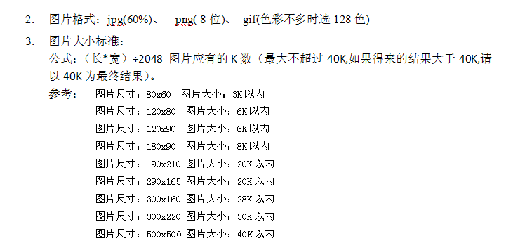

## 让iframe的背景透明
1. 所嵌页面的body设置background-color为transparent
1. Iframe的allowTransparency属性为true


## escape()、encodeURI()、encodeURIComponent()的区别

1. `escape`方法并不编码字符`+`。而我们知道，在用户提交的表单字段中，如果有空格，则会被转化为`+`字符，而服务器解析的时候则会认为`+`号代表空格。
	由于这个缺陷，`escape`方法并不能正确地处理所有的非ASCII字符，你应当尽量避免使用`escape`方法，取而代之，你最好选择`encodeURIComponent()`方法。
	`escape()`不编码的字符：`@*/+`

1. 相对于使用`escape`方法，使用`encodeURI`方法会显得更专业一些。当你需要编码一整个URI的时候，你可以使用此方法，因为URI中的合法字符都不会被编码转换。需要注意到是字符‟也是URI中的合法字符，所以也不会被编码转换。
	`encodeURI()`不编码的字符：`~!@#$&*()=:/,;?+''`

1. `encodeURIComponent`方法在编码单个`URIComponent`（指请求参数）应当是最常用的。需要注意到是字符‟也是URI中的合法字符，所以也不会被编码转换。
	`encodeURIComponent()`不编码的字符：`~!*()''`


## 获取标签便签中的字符：[\s\S]*
以简单的a为例：`/<a>[\s\S]*<\/a>/`
用 `.*` 的话会将 `</a>` 之后的字符都包含


## jsDoc参数规范

|名称 | 说明 |
|-|-|
|@param | 参数 |
|@argument | 指定参数名和说明来描述一个函数参数。|
|@return | |
|@returns | 描述函数的返回值。 |
|@author | 指示代码的作者。 |
|@deprecated | 指示一个函数已经废弃，不建议使用，而且在将来版本的代码中可能会彻底删除。要避免使用这段代码。 |
|@see | 创建一个HTML链接指向指定类的描述。 |
|@version | 指定发布版本。 |
|@requires | 创建一个HTML链接，指向这个类所需的指定类。 |
|@throws | |
|@exception | 描述函数可能抛出的异常的类型。|
|{@link} | 创建一个HTML链接，指向指定的类。这与@see很类似，但{@link}能嵌在注释文本中。 |
|@author | 指示代码的作者。（译者注：这个标记前面已经出现过，建议去掉）|
|@fileoverview | 这是一个特殊的标记，如果在文件的第一个文档块中使用这个标记，则指定该文档块的余下部分将用来提供文件的一个概述。 |
|@class | 提供类的有关信息，用在构造函数的文档中。 |
|@constructor | 明确一个函数是某个类的构造函数。 |
|@type | 指定函数的返回类型。 |
|@extends | 指示一个类派生了另一个类。通常JSDoc自己就可以检测出这种信息，不过，在某些情况下则必须使用这个标记。 |
|@private | 指示一个类或函数是私有的。私有类和函数不会出现在HTML文档中，除非运行JSDoc时提供了—private命令行选项。 |
|@final | 指示一个值是常量值。要记住JavaScript无法真正保证一个值是常量。 |
|@ignore | JSDoc会忽略有这个标记的函数。 |

jsDoc实例：

```
/**
* @fileoverview This file is an example of how JSDoc can be used to document
* JavaScript.
*
* @author Ryan Asleson
* @version 1.0
*/

/**
* Construct a new Person class.
* @class This class represents an instance of a Person.
* @constructor
* @param {String} name The name of the Person.
* @return A new instance of a Person.
*/

function Person(name) {

/**
* The Person's name
* @type String
*/

this.name = name;

/**
* Return the Person's name. This function is assigned in the class
* constructor rather than using the prototype keyword.
* @returns The Person's name
* @type String
*/

this.getName = function() {
	return name;
	}
}

/**
* Construct a new Employee class.
* @extends Person
* @class This class represents an instance of an Employee.
* @constructor
* @return A new instance of a Person.
*/

function Employee(name, title, salary) {
this.name = name;

/**
* The Employee's title
* @type String
*/

this.title = title;

/**
* The Employee's salary
* @type int
*/

this.salary = salary;
}

/* Employee extends Person */
Employee.prototype = new Person();

/**
* An example of function assignment using the prototype keyword.
* This method returns a String representation of the Employee's data.
* @returns The Employee's name, title, and salary
* @type String
*/

Employee.prototype.getDescription = function() {
	return this.name + " - "
		+ this.title + " - "
		+ "$" + this.salary;
}
```


## 图片大小规范




## flash的最简引用

```
<object width="989" height="315" codebase="http://download.macromedia.com/pub/shockwave/cabs/flash/swflash.cab#version=9,0,28,0" classid="clsid:D27CDB6E-AE6D-11cf-96B8-444553540000">
    <param value="high" name="quality"/>
    <param value="transparent" name="wmode"/>
    <param value="path/to/myflash.swf" name="movie"/>
    <embed width="989" height="315" type="application/x-shockwave-flash" pluginspage="http://www.adobe.com/shockwave/download/download.cgi?P1_Prod_Version=ShockwaveFlash" quality="high" wmode="transparent" src="path/to/myflash.swf"/>
</object>
```

## ie6 不支持position:fix的解决方案

1.通过 `<!--[if lte IE 7]>...<![endif] -->` 用导入js解决
2.通过 css hack 解决

```
/* 头部固定 */
.fixed-top {
	position:fixed;bottom:auto;top:0px;
}

/* 底部固定 */
.fixed-bottom {
	position:fixed;bottom:0px;top:auto;
}

/* 左侧固定 */
.fixed-left {
	position:fixed;right:auto;left:0px;
}

/* 右侧固定 */
.fixed-right {
	position:fixed;right:0px;left:auto;
}


/* 上面的是除了IE6的主流浏览器通用的方法 */


/* 修正IE6振动bug */
* html,* html body {
	background-image:url(about:blank);background-attachment:fixed;
}

/* IE6 头部固定 */
* html .fixed-top {
	position:absolute;bottom:auto;top:expression(eval(document.documentElement.scrollTop));
}

/* IE6 右侧固定 */
* html .fixed-right  {
	position:absolute;right:auto;left:expression(eval(document.documentElement.scrollLeft+document.documentElement.clientWidth-this.offsetWidth)-(parseInt(this.currentStyle.marginLeft,10)||0)-(parseInt(this.currentStyle.marginRight,10)||0));
}

/* IE6 底部固定 */
* html .fixed-bottom {
	position:absolute;bottom:auto;top:expression(eval(document.documentElement.scrollTop+document.documentElement.clientHeight-this.offsetHeight-(parseInt(this.currentStyle.marginTop,10)||0)-(parseInt(this.currentStyle.marginBottom,10)||0)));
}

/* IE6 左侧固定 */
* html .fixed-left {
	position:absolute;right:auto;left:expression(eval(document.documentElement.scrollLeft));
}
```


## 注释型 html 文件头（.ie6、.ie7、.ie8）

```
<!doctype html>
<!--[if lt IE 7 ]><html lang="zh-cn" class="ie6"><![endif]-->
<!--[if IE 7 ]><html lang="zh-cn" class="ie7"><![endif]-->
<!--[if IE 8 ]><html lang="zh-cn" class="ie8"><![endif]-->
<!--[if IE 9 ]><html lang="zh-cn" class="ie9"><![endif]-->
<!--[if (gt IE 9)|!(IE)]><!--><html lang="zh-cn"><!--<![endif]-->
<head>
```

这样以后，针对 ie 的兼容性写就好了（或者说不用那么奇葩了）！！！

```
/* 针对 ie6 或以下版本 */
.ie6 .xx {...}

/* 针对 ie7 */
.ie7 .xx {...}

/* 针对 ie8 */
.ie8 .xx {...}

/* 针对 ie9 以上版本或非 ie 浏览器 */
.xx {...}
```

同时，这样也能通过 firebug 的 css 检测，因为不用再用 css hack 了


## 最外层的滚动条来源于html，在获取 scrollTop 或者 scrollLeft 时要尤为注意

```
<!DOCTYPE html>
<html lang="en">
<head>
    <meta charset="UTF-8">
    <title>滚动</title>
</head>
<body>
    <div id="debug" style="position: fixed;top: 0;left: 0;">&nsbp;</div>
    <div style="height: 2000px;"></div>

    <script src="http://lib.sinaapp.com/js/jquery/1.9.1/jquery-1.9.1.min.js"></script>
    <script>
        var
            _root = $("html"),
            _body = _root.find("body"),
            _debug = _root.find("#debug");

        _body.on("scroll", function() { // 来自于 body 的滚动
            _debug.html( _debug.html() + '<br>' + $(this).scrollTop() + '(from body)' );
        });

        _root.on("scroll", function() { // 来自于 html 的滚动
            _debug.html( _debug.html() + '<br>' + $(this).scrollTop() + '(from html)' );
        });

        $(window).on("scroll", function() { // 来自于 window 的滚动
            _debug.html( _debug.html() + '<br>' + $(this).scrollTop() + '(from window)' );
        });

        /**
         * 经测试，数据如下：
         *
         *          页面滚动来源（最外的滚动条）
         * ie9      html
         * ie8      html
         * ie7      html,body (body的scrollTop一直为0)
         * ie6      html
         * ff       html
         * chrome   html
         */
    </script>
</body>
</html>
```