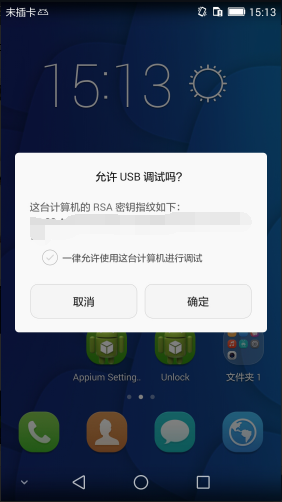

# Appium Desktop 初用

## 摘要

* 下载链接（下载 Appium Desktop 比下载 Appium 容易多了。。。）：

    * 官方：[https://github.com/appium/appium-desktop/releases](https://github.com/appium/appium-desktop/releases)

* `Appium Desktop` : 其实是对 Appium 的工具链强化，趋于 UI 操作，而不是命令行操作，以下是其大概的组成部分（该内容可略过）

    * `Server` : Appium 服务端，除了 Appium Server（即 Automatic Server），还可以是自定义服务端和第三方在线服务端

    * `Logs` : 日志信息，并能生成文件（这应该算是 Automatic Server 附属功能）

    * `Inspector` : 对 app 中的元素，进行定位查找，并可进行操作（Tap、Send Keys、Clear）

    * `Session` : 编写 Desired Capabilities，并生成对应 JSON，同时可以测试所写的 Capabilities 是否能正常连接到真机或模拟器，并打开对应的应用

        * [Appium Desired Capabilities](http://appium.io/docs/en/writing-running-appium/caps/index.html) 英文官方文档

    * `Recorder` : 一边进行 `Inspector` 的操作，一边生成 Appium Client 的代码（包括 `JS - WD`、`JS - Webdriver.io`、`Java - JUnit`、`Python`、`Ruby` 等，点击下拉框隔壁的 `Show/hide Boilerplate Code` 按钮，显示完成的代码）

    * 还有 Appium Desktop 自动更新之类的就不写了。。。

* 注意：

    * 模拟器或真机，返回到系统首页，再进行联机操作（不然可能会报 `Error occured while starting App. Original error: Error executing adbExec.` 错误）

    * 电脑连手机进行操作时，手机会弹出授权界面，必须确认授权
    
    
    * 如果连接时报错，有很大可能会死循环操作，不怕！**重启 Server 端吧！**
