## css3文字图标制作过程

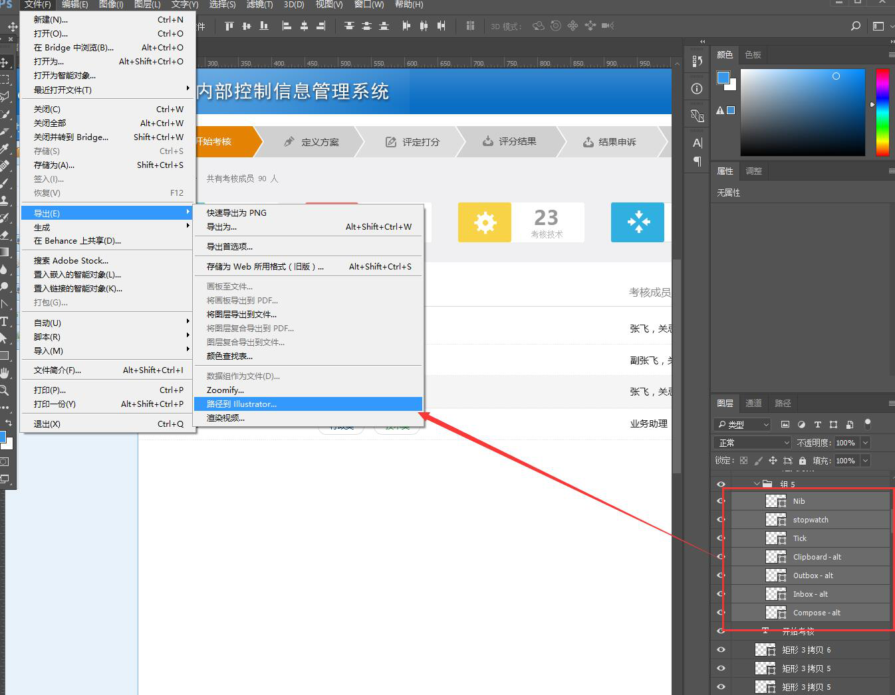

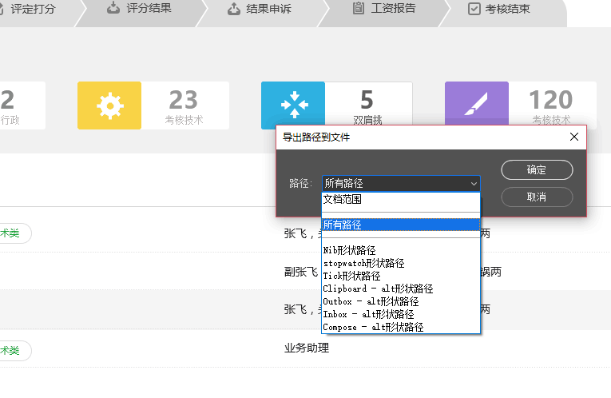

然后这里保存AI路径

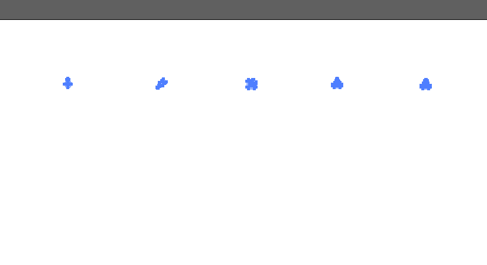

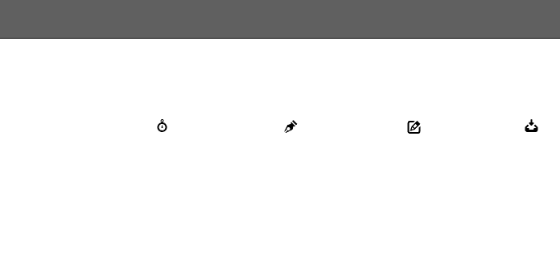

AI中打开后默认是白色的，所以看不到，先选中后改一下颜色，改成黑色，再单个保存，注意保存时的画布一般来说不要太大，用正方形，比如说128PX这样

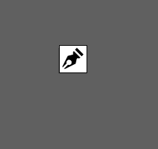

保存成SVG就可以了
接着是最重要的步骤了
https://icomoon.io/
在这个网站上

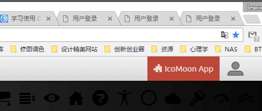

点这个

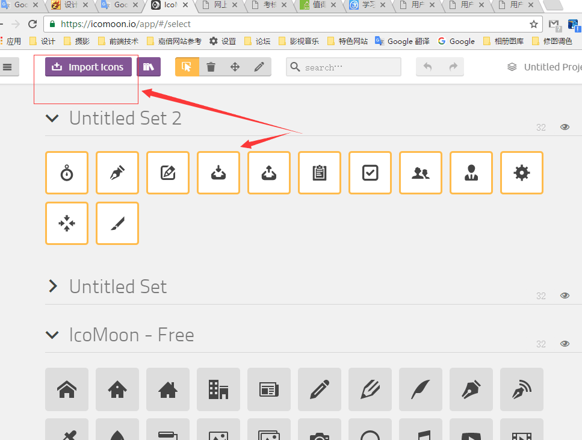

点添加就会出现，选中后在底部有一个菜单

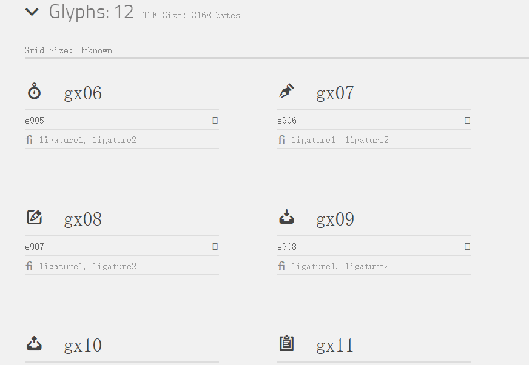

这就是最生成的内容了

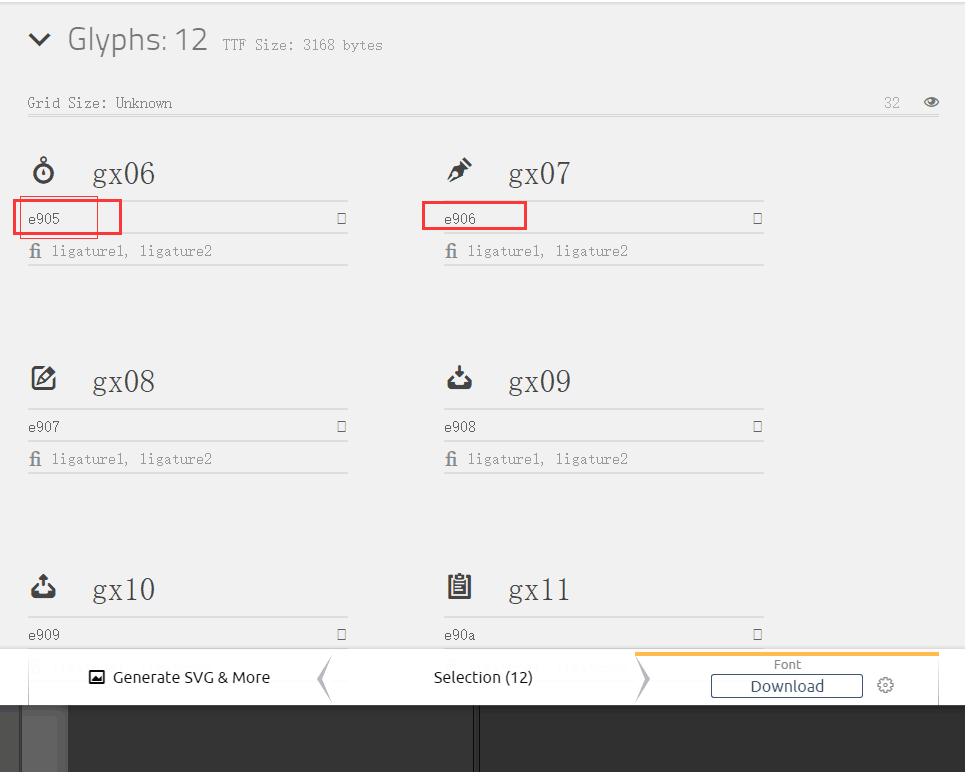

用的时候在样式里引用这个即可

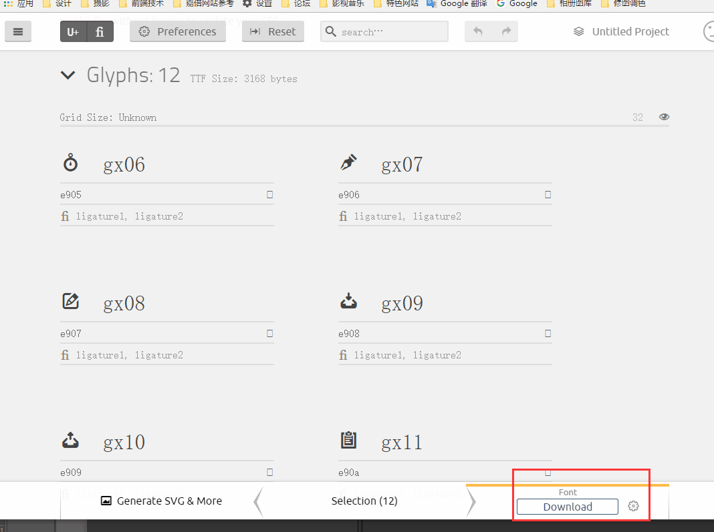

下面这可以打包下载到本地

点那个齿轮后还可以设置兼容性和文件前缀

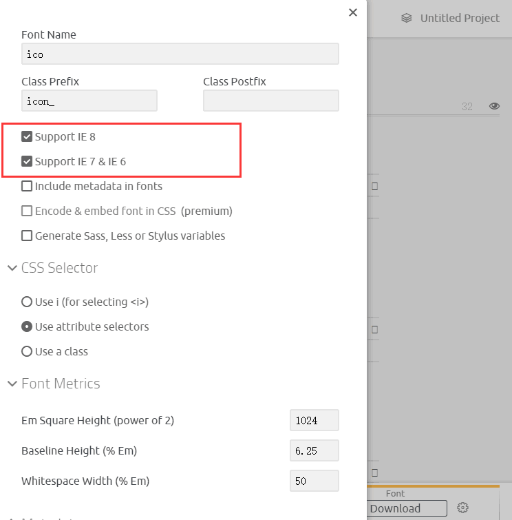

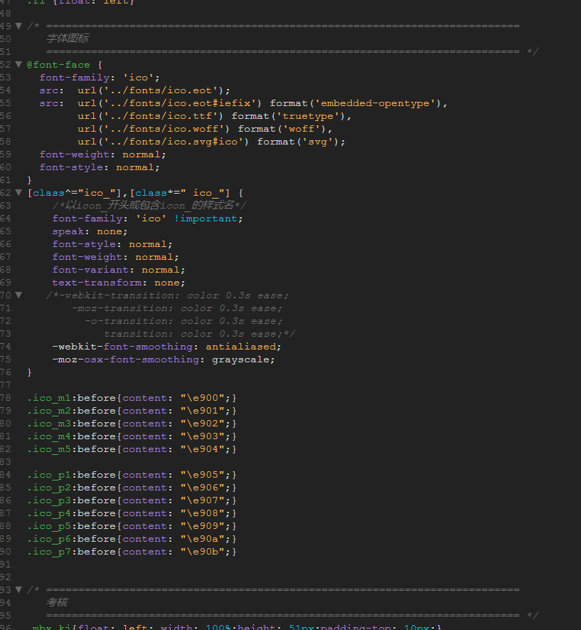

样式里是这样用的
