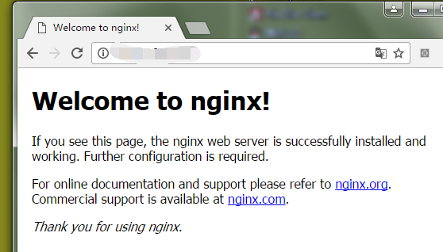

# nginx 安装、配置、开通 80 端口

## 使用 `yum` 安装 `nginx`

### 1. 追加 nginx 的 yum 仓库

创建 `nginx.repo` 文件

```
vi /etc/yum.repos.d/nginx.repo
```

文件内容为

```
[nginx]
name=nginx repo
baseurl=http://nginx.org/packages/centos/$releasever/$basearch/
gpgcheck=0
enabled=1
```

### 2. 安装 `nginx`

```
yum -y install nginx
```

查看 `nginx` 文件位置

```
[root@localhost ~]# find / -name *nginx*  
/etc/nginx/nginx.conf  
[root@localhost ~]# whereis nginx  
nginx: /usr/sbin/nginx /etc/nginx /usr/share/nginx
```

### 3. 启动 `nginx`

```
service nginx start
```

查看 `nginx` 进程

```
[root@localhost ~]# netstat -lntp | grep nginx  
tcp        0      0 0.0.0.0:80                  0.0.0.0:*                   LISTEN      7910/nginx            

[root@localhost ~]# ps -ef | grep nginx  
root      7910     1  0 23:43 ?        00:00:00 nginx: master process /usr/sbin/nginx -c   
/etc/nginx/nginx.conf  
nginx     7912  7910  0 23:43 ?        00:00:00 nginx: worker process                     
root      7942  2459  0 23:52 pts/1    00:00:00 grep nginx
```

### 4. 设置开机启动 `nginx`

```
chkconfig nginx on
```

### 5. 开通 `80` 端口

```
[root@localhost ~]# /sbin/iptables -I INPUT -p tcp --dport 80 -j ACCEPT
[root@localhost ~]# /etc/rc.d/init.d/iptables save
iptables：将防火墙规则保存到 /etc/sysconfig/iptables：     [确定]
```

查看防火墙状态（看到 `tcp dpt:80` 即开通成功）

```
[root@localhost ~]# /etc/init.d/iptables status
表格：filter
Chain INPUT (policy ACCEPT)
num  target     prot opt source               destination         
1    ACCEPT     tcp  --  0.0.0.0/0            0.0.0.0/0           tcp dpt:80
2    ACCEPT     all  --  0.0.0.0/0            0.0.0.0/0           state RELATED,ESTABLISHED
3    ACCEPT     icmp --  0.0.0.0/0            0.0.0.0/0           
4    ACCEPT     all  --  0.0.0.0/0            0.0.0.0/0           
5    ACCEPT     tcp  --  0.0.0.0/0            0.0.0.0/0           state NEW tcp dpt:22
6    REJECT     all  --  0.0.0.0/0            0.0.0.0/0           reject-with icmp-host-prohibited

Chain FORWARD (policy ACCEPT)
num  target     prot opt source               destination         
1    REJECT     all  --  0.0.0.0/0            0.0.0.0/0           reject-with icmp-host-prohibited

Chain OUTPUT (policy ACCEPT)
num  target     prot opt source               destination  
```

重启防火墙

```
[root@localhost ~]# /etc/init.d/iptables restart
```

### 6. 在外网输入 `http://<服务器地址>` 看是否有 `nginx` 默认页面显示



> 配置文件的路径为 `/etc/nginx/nginx.conf`
>
> 通过文件中 `include /etc/nginx/conf.d/*.conf;` 这行，可看出配置文件在 `/etc/nginx/conf.d` 这个目录
>
> 默认配置的路径为 `/etc/nginx/conf.d/default.conf`
>
> 该默认页的路径为 `/usr/share/nginx/html/index.html`
>
> 所以可以在 `/etc/nginx/conf.d` 这个目录新增站点的配置（如 `mysite.conf`）
>
> 没用的站点配置，可添加 `.back` 等后缀即可（如 `default.conf.back`）


## 来源

* [CentOS6.5使用yum命令方便快捷安装Nginx](https://my.oschina.net/ramboo/blog/223408)

* [Centos 开放80端口](http://www.cnblogs.com/cnjava/p/3311950.html)
