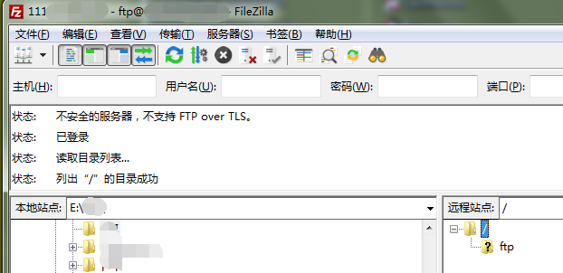

# vsftpd 安装、配置、开通 21 端口

## 使用 `yum` 安装 `vsftpd`

### 1. 禁用 `selinux` 服务

```
vi /etc/selinux/config
```

将 `SELINUX=enforcing` 改为 `SELINUX=disabled`

然后重启服务器

### 2. 安装 `vsftpd`

```
yum -y install vsftpd
```

### 3. 添加用户和密码（for 系统）

添加一个名字为 `ftp` 的用户，并为其设置密码（密码用户 ftp 连接时使用）

```
[root@localhost ~]# useradd ftp
useradd: user 'ftp' already exists
[root@localhost ~]# passwd ftp
更改用户 ftp 的密码 。
新的 密码：
重新输入新的 密码：
passwd： 所有的身份验证令牌已经成功更新。
```

### 4. 添加用户（for `vsftpd`）

编辑服务器的用户列表

```
vi /etc/vsftpd/user_list
```

在最后一行添加 `ftp`

```
# vsftpd userlist
# If userlist_deny=NO, only allow users in this file
# If userlist_deny=YES (default), never allow users in this file, and
# do not even prompt for a password.
# Note that the default vsftpd pam config also checks /etc/vsftpd/ftpusers
# for users that are denied.
root
bin
daemon
adm
lp
sync
shutdown
halt
mail
news
uucp
operator
games
nobody
ftp
```

### 5. 修改 `vsftpd` 配置

```
vi /etc/vsftpd/vsftpd.conf
```

修改如下：

* `userlist_enable=YES` 改为 `userlist_enable=NO`

* `#write_enable=YES` 改为 `write_enable=YES`，`#anon_upload_enable=YES` 改为 `anon_upload_enable=YES`，这样才能上传文件

* `#anon_mkdir_write_enable=YES` 改为 `anon_mkdir_write_enable=YES`，这样才能上传文件夹

* 添加 `anon_umask=022`，这样上传的文件才能被下载

* 添加 `anon_other_write_enable=YES`，使文件夹及其内容可以上传

### 6. 启动服务器

```
service vsftpd start
```

### 7. 开机启动

```
chkconfig vsftpd on
```

### 8. 开通 `21` 端口

```
[root@localhost ~]# /sbin/iptables -I INPUT -p tcp --dport 21 -j ACCEPT
[root@localhost ~]# /etc/rc.d/init.d/iptables save
iptables：将防火墙规则保存到 /etc/sysconfig/iptables：     [确定]
```

查看防火墙状态（看到 `tcp dpt:21` 即开通成功）

```
[root@localhost ~]# /etc/init.d/iptables status
表格：filter
Chain INPUT (policy ACCEPT)
num  target     prot opt source               destination         
1    ACCEPT     tcp  --  0.0.0.0/0            0.0.0.0/0           tcp dpt:21
2    ACCEPT     tcp  --  0.0.0.0/0            0.0.0.0/0           tcp dpt:80
3    ACCEPT     all  --  0.0.0.0/0            0.0.0.0/0           state RELATED,ESTABLISHED
4    ACCEPT     icmp --  0.0.0.0/0            0.0.0.0/0           
5    ACCEPT     all  --  0.0.0.0/0            0.0.0.0/0           
6    ACCEPT     tcp  --  0.0.0.0/0            0.0.0.0/0           state NEW tcp dpt:22
7    REJECT     all  --  0.0.0.0/0            0.0.0.0/0           reject-with icmp-host-prohibited

Chain FORWARD (policy ACCEPT)
num  target     prot opt source               destination         
1    REJECT     all  --  0.0.0.0/0            0.0.0.0/0           reject-with icmp-host-prohibited

Chain OUTPUT (policy ACCEPT)
num  target     prot opt source               destination  
```

重启防火墙

```
[root@localhost ~]# /etc/init.d/iptables restart
```

### 9. 修改默认上传目录（`/var/ftp` -> `/home/wwwroot`）【可以跳过】

添加上传文件夹 `/home/wwwroot/ftp`

```
[root@localhost ~]# mkdir -p /home/wwwroot/ftp
[root@localhost ~]# chmod -R 777 /home/wwwroot/ftp
```

添加配置（`vi /etc/vsftpd/vsftpd.conf`）

```
local_root=/home/wwwroot
chroot_local_user=YES
anon_root=/home/wwwroot
```

> 文件是上传不到 `/home/wwwroot`，只能上传到 `/home/wwwroot/ftp`，除非中途（未关闭上传工具）修改 `/home/wwwroot` 权限为 `777`，但如果修改，下次连接 `vsftpd` 服务器就会报 `500 OOPS: vsftpd: refusing to run with writable anonymous root` 错误

### 10. 使用 `FileZilla` 连接 `ftp` 服务器

传输方式必须要使用 `主动`，不然会连接超时导致失败，设置如下


点击 “确定” 后，再重新进入面板点击 “连接”，输入密码后，成功连接如下图



该上传目录对应路径为 `/var/ftp`，`pub` 为其中的文件夹

### 11. 错误及相关处理

#### 553 Could not create file

这是因为文件夹权限问题，服务器需要执行 `chmod -R 777 pub` 修改文件夹权限

```
[root@localhost ~]# cd /var/ftp
[root@localhost ftp]# ll
总用量 4
drwxr-xr-x. 2 root root 4096 5月  11 2016 pub
[root@localhost ftp]# chmod -R 777 pub
[root@localhost ftp]# ll
总用量 4
drwxrwxrwx. 2 root root 4096 1月   6 12:52 pub
```

#### 550 Failed to open file

下载二进制文件到本地，所报的错误（文本文件可以正常下载）

添加下面配置到 `/etc/vsftpd/vsftpd.conf` 中，这样，上传的文件都能下载

```
anon_umask=022
```

#### 500 OOPS: vsftpd: refusing to run with writable anonymous root

vsftpd 出于安全考虑，对文件夹权限为 `drwxrwxrwx`（如 `chmod 777 /my/ftp`），不能进行上传操作

对上传的文件夹，需要降低一点权限，如执行下面操作

```
[root@localhost ~]# chown root:root /my/ftp
[root@localhost ~]# chmod 755 /my/ftp
```


## 来源

* [CentOS6.5使用yum命令方便快捷安装Nginx](https://my.oschina.net/ramboo/blog/223408)

* [Centos 开放80端口](http://www.cnblogs.com/cnjava/p/3311950.html)

* [如何在linux下开启FTP服务](https://zhidao.baidu.com/question/689008727188957044.html)

* [vsftp上传文件出现553 Could not create file解决方法](http://blog.chinaunix.net/uid-20680669-id-3142726.html)

* [local_umask=022是什么意思](http://blog.163.com/qimo601@126/blog/static/1582209320131110103325986/)

* [解决vsftp无法上传文件及文件夹的问题](http://www.2cto.com/os/201407/316668.html)

* [500 OOPS: vsftpd: refusing to run with writable anonymous root](http://www.blogjava.net/fingki/archive/2009/07/13/286526.html)

* [vsftpd控制用户禁止访问上级目录 只能访问自己目录](http://www.it165.net/admin/html/201308/1695.html)
