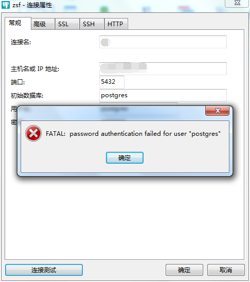

# postgresql 安装、配置

## 使用 `yum` 安装

### 1. 获取 rpm 来源

进入 [http://yum.postgresql.org](http://yum.postgresql.org)，寻找最新稳定版的链接，如 [https://yum.postgresql.org/repopackages.php#pg96](https://yum.postgresql.org/repopackages.php#pg96)，复制合适平台的链接，如 [CentOS 6 - x86_64](https://download.postgresql.org/pub/repos/yum/9.6/redhat/rhel-6-x86_64/pgdg-centos96-9.6-3.noarch.rpm)，执行下面命令

```
yum -y localinstall https://download.postgresql.org/pub/repos/yum/9.6/redhat/rhel-6-x86_64/pgdg-centos96-9.6-3.noarch.rpm
```

### 2. 安装服务端

```
yum -y install postgresql96-server.x86_64
```

> 通过 `yum list postgres*` 可以查看可安装和已安装的 pgsql 及其周边插件，如下所示

### 3. 初始化数据库（仅需运行一次）

```
service postgresql-9.6 initdb
```

> 运行后会生成 `/var/lib/pgsql/9.6/data` （变量 `PGDATA` 指向该文件夹）文件夹及其下相关文件，如下所示 

### 4. 开机启动

```
chkconfig postgresql-9.6 on
```

### 5. 服务控制

```
service postgresql-9.6 start/stop/restart/reload
```

### 6. 卸载

```
yum erase postgresql96*
```

### 7. 修改系统用户 `postgres` 密码

```
passwd postgres
```


> `PostgreSQL` 数据库默认会创建一个 linux 系统用户 `postgres`，此用于数据库登录及其操作使用


### 8. 实现远程访问

#### 8.1. 修改配置文件 `postgresql.conf`

```
vi /var/lib/pgsql/9.6/data/postgresql.conf
```

`#listen_addresses = 'localhost'` 改为 `listen_addresses = '*'`

#### 8.2. 修改认证文件 `pg_hba.conf`

```
vi /var/lib/pgsql/9.3/data/pg_hba.conf
```

```
# IPv4 local connections:
host    all             all             127.0.0.1/32            ident
```

改为

```
# IPv4 local connections:
host    all             all             0.0.0.0/0            md5
```

> 最后一个值如为 `trust`，则远程连接数据库无需任何密码即可连上，不建议使用

#### 8.3. 添加数据库密码

```
sudo -u postgres psql
ALTER USER postgres with encrypted password 'your_password';
```

成功后，按 `ctrl+D` 退出 postgresql shell

> * 必须要进行这一步，不然会因密码缺失，报验证错误 
>
> * `"sudo -u username#uid"`，以指定用户的身份执行命令。后面的用户是除 `root` 以外的，可以是用户名，也可以是 `#uid`。`"sudo -u postgres psql"` 即以 `postgres` 用户身份打开 `psql`（postgresql shell）

#### 8.4. 重启 postgresql

```
service postgresql-9.6 restart
```

#### 8.5. 防火墙开通 5432 端口

```
/sbin/iptables -I INPUT -p tcp --dport 5432 -j ACCEPT
/etc/rc.d/init.d/iptables save
```

#### 8.6. 测试是否远程连接成功

试试非本地使用 `Navicat Premium` 等客户端进行连接测试，看是否成功


连接成功会是以下界面：


连接失败有可能是以下界面：



### 9. 附加

#### 9.1. postgresql shell 使用

进入 shell

```
sudo -u postgres psql
```

执行 `CREATE DATABASE mydb`


生成新的数据库


> * 在 shell 中，可按 `ctrl+D` 退出 postgresql shell
>
> * 每一行的结束必须是 `";"`

#### 9.2. postgresql 命令使用

如果不想进入 postgresql shell 进行操作，也可以直接使用命令行进行快速操作：

* 创建数据库：`createdb -h 127.0.0.1 -p 5432 -U postgres testdb`
* 连接数据库：`psql -h 127.0.0.1 -p 5432 -U postgres testdb`
* 删除数据库：`dropdb -h 127.0.0.1 -p 5432 -U postgres testdb`

说明：`-h` 表示主机（Host），`-p` 表示端口（Port），`-U` 表示用户（User）

* 创建数据表：`create table tbl(a int);`
* 删除数据表：`drop table tbl;`
* 插入数据：`insert into tbl(a) values(1);`
* 查看数据：`select * from tbl;`
* 备份数据库：`pg_dump -U postgres  testdb > d:/testdb.dmp`
* 恢复数据库：`psql -U postgres testdb < d:/testdb.dmp`

## 来源

* [CentOS下，yum安装PostgreSQL ](http://blog.csdn.net/gaojinshan/article/details/40980653)

* [psql: FATAL: password authentication failed for user](https://stackoverflow.com/questions/19778510/psql-fatal-password-authentication-failed-for-user)

* [linux sudo 命令](http://www.cnblogs.com/xiaochaohuashengmi/archive/2011/11/11/2245341.html)