# 缩放模式、横竖版设置

## 横竖版设置（`data-content-width`、`data-content-height`）

通过设置 `index.html` 文件中 `data-content-width` 和 `data-content-height` 的值

1. 横版（游戏）：`data-content-width` 大于 `data-content-height`

1. 竖版（游戏）：`data-content-width` 少于 `data-content-height`

## 缩放模式（`data-scale-mode` 或 `this.stage.scaleMode`）

### 下载

* 竖屏场景原图：[pic.jpg](download/pic.jpg)
* 横屏场景原图：[pic2.jpg](download/pic2.jpg)
* 竖屏效果截图：[game-view-w720-h1280.zip](download/game-view-w720-h1280.zip)
* 横屏效果截图：[game-view-w1280-h720.zip](download/game-view-w1280-h720.zip)

### 设计稿尺寸

* 横屏的为 `1280x720`
* 竖屏的为 `720x1280`

### 宿主环境

分辨率为 `320x480` 的 iPhone4【使用 Chrome 手机调试模式模拟】

### `Main.ts` 主要代码

```
// this.stage.scaleMode = egret.StageScaleMode.EXACT_FIT;
// this.stage.scaleMode = egret.StageScaleMode.FIXED_HEIGHT;
// this.stage.scaleMode = egret.StageScaleMode.FIXED_NARROW;
// this.stage.scaleMode = egret.StageScaleMode.FIXED_WIDE;
// this.stage.scaleMode = egret.StageScaleMode.FIXED_WIDTH;
// this.stage.scaleMode = egret.StageScaleMode.NO_BORDER;
// this.stage.scaleMode = egret.StageScaleMode.NO_SCALE;
this.stage.scaleMode = egret.StageScaleMode.SHOW_ALL;

let sw = this.stage.stageWidth;
let sh = this.stage.stageHeight;

let bg = new egret.Bitmap();
let lt = new egret.Shape();
let rt = new egret.Shape();
let lb = new egret.Shape();
let rb = new egret.Shape();

let txt = new egret.TextField();

// bg.texture = RES.getRes( 'pic_jpg' ); // 竖屏场景图片
bg.texture = RES.getRes( 'pic2_jpg' ); // 横屏场景图片
bg.x = 0;
bg.y = 0;

lt.graphics.beginFill( 0xff0000 );
lt.graphics.drawRect( 10, 10, 100, 100 );
lt.graphics.endFill();

rt.graphics.beginFill( 0xff0000 );
rt.graphics.drawRect( sw - 100 - 10, 10, 100, 100 );
rt.graphics.endFill();

lb.graphics.beginFill( 0xff0000 );
lb.graphics.drawRect( 10, sh - 100 - 10, 100, 100 );
lb.graphics.endFill();

rb.graphics.beginFill( 0xff0000 );
rb.graphics.drawRect( sw - 100 - 10, sh - 100 - 10, 100, 100 );
rb.graphics.endFill();

txt.text = this.stage.scaleMode;
txt.stroke = 2;
txt.strokeColor = 0xffffff;
txt.size = 50;
txt.textColor = 0x000000;
txt.anchorOffsetX = txt.width / 2;
txt.anchorOffsetY = txt.height / 2;
txt.x = sw / 2;
txt.y = sh / 2;

this.addChild( bg );
this.addChild( lt );
this.addChild( rt );
this.addChild( lb );
this.addChild( rb );
this.addChild( txt );
```

### 最终效果截图

<table>
	<tr>
		<th>缩放类型</th>
		<th>横屏（720x1280）</th>
		<th>竖屏（720x1280）</th>
		<th>横屏（1280x720）</th>
		<th>竖屏（1280x720）</th>
	</tr>
	<tr>
		<th>
			exactFit
		</th>
		<td>
			
		</td>
		<td>
			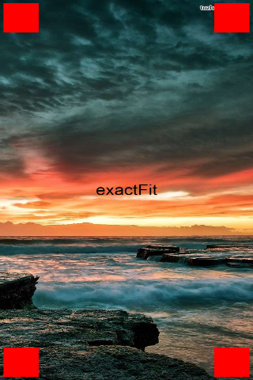
		</td>
		<td>
			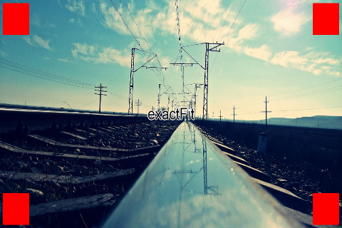
		</td>
		<td>
			
		</td>
	</tr>
	<tr>
		<th>
			fixedHeight
		</th>
		<td>
			
		</td>
		<td>
			
		</td>
		<td>
			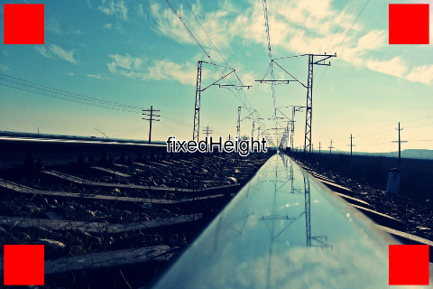
		</td>
		<td>
			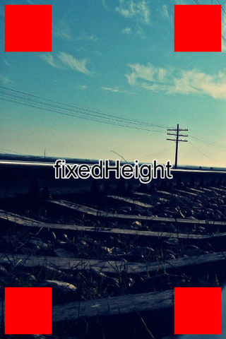
		</td>
	</tr>
	<tr>
		<th>
			fixedNarrow
		</th>
		<td>
			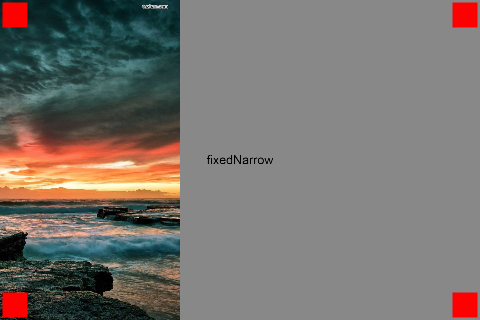
		</td>
		<td>
			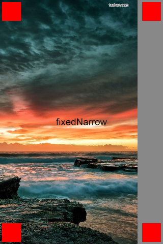
		</td>
		<td>
			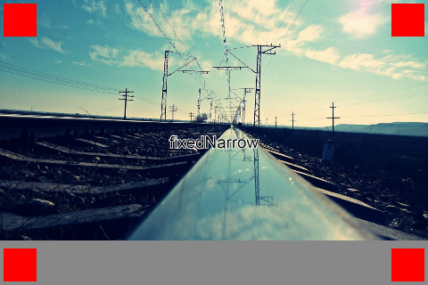
		</td>
		<td>
			
		</td>
	</tr>
	<tr>
		<th>
			fixedWide
		</th>
		<td>
			
		</td>
		<td>
			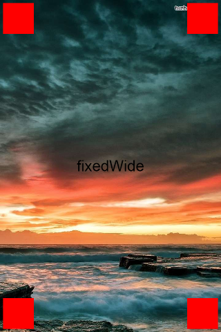
		</td>
		<td>
			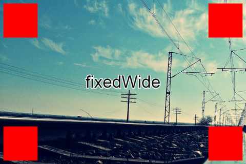
		</td>
		<td>
			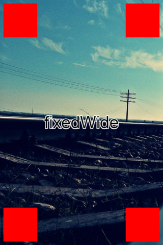
		</td>
	</tr>
	<tr>
		<th>
			fixedWidth
		</th>
		<td>
			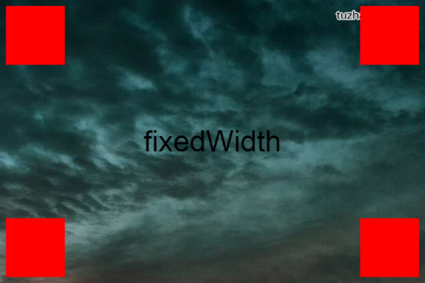
		</td>
		<td>
			
		</td>
		<td>
			
		</td>
		<td>
			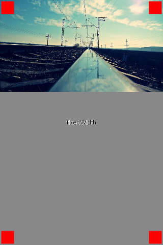
		</td>
	</tr>
	<tr>
		<th>
			noBorder
		</th>
		<td>
			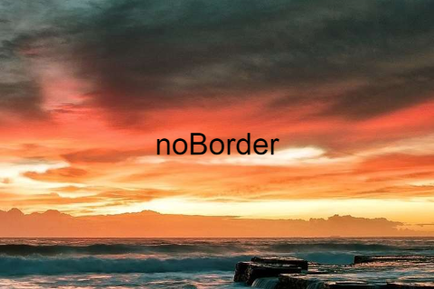
		</td>
		<td>
			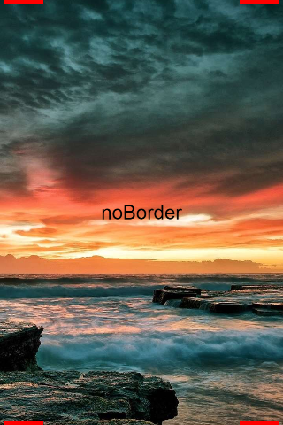
		</td>
		<td>
			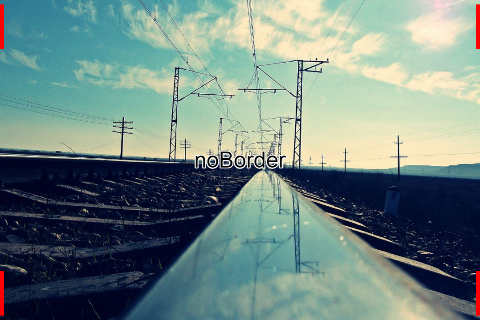
		</td>
		<td>
			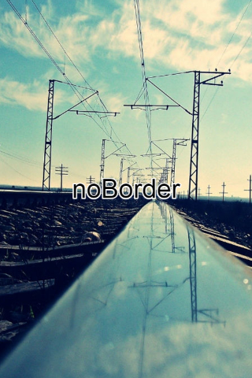
		</td>
	</tr>
	<tr>
		<th>
			noScale
		</th>
		<td>
			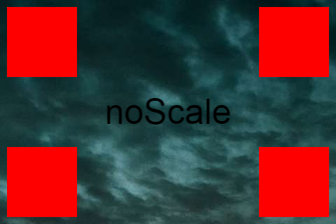
		</td>
		<td>
			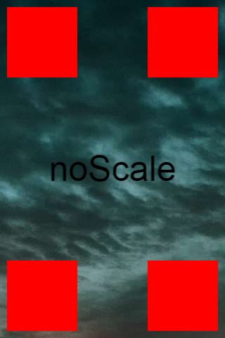
		</td>
		<td>
			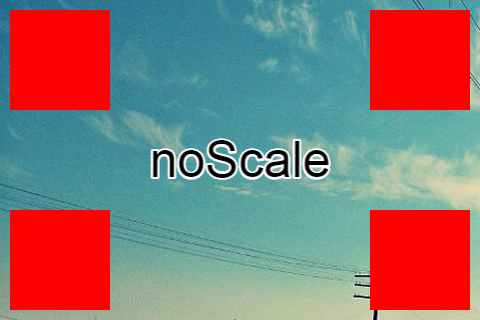
		</td>
		<td>
			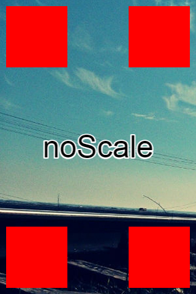
		</td>
	</tr>
	<tr>
		<th>
			showAll
		</th>
		<td>
			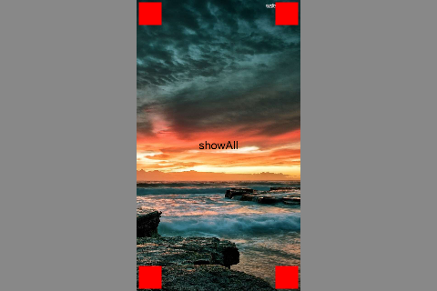
		</td>
		<td>
			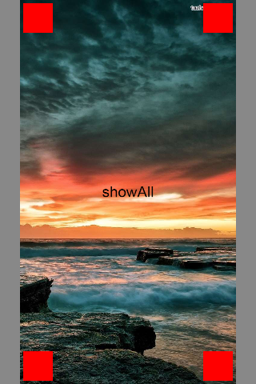
		</td>
		<td>
			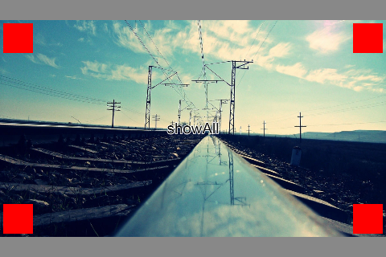
		</td>
		<td>
			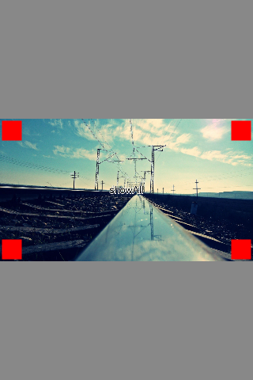
		</td>
	</tr>
</table>

## 总结

1. 还原得最好的是 `showAll` 模式，能达到 `1:1`，但场景区域与操作区域会留白

1. 其次是 `1280x720` 下的 `fixedHeight` 和 `720x1280` 下的 `fixedWidth`，能全屏，但场景会裁剪，注意场景居中

1. 再者是 `fixedNarrow` 模式，场景图能全貌展示，但会留白，注意场景居中

1. 次之是 `exactFit` 模式，能全屏，但会拉伸变形

1. 为了更好的全屏效果，建议竖屏（游戏）搭配 `data-orientation="portrait"`，横屏（游戏）搭配 `data-orientation="landscape"`
