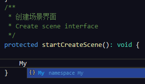
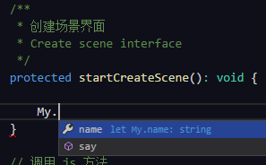
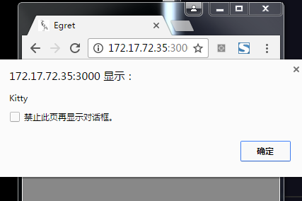

# 能被 ts 调用的 js（最简版）

> 下载[相关文件](download/my.zip)

如果你写了一个 `js` 文件，名为 `my.js`，內容如下：

```
var My = {
    name    : 'Kitty'
    , say   : function ( name ) {
        alert( name || this.name );
    }
};
```

> 文件为：/libs/my/my.js

为了讨好 `IDE`，并且想在 `Main.ts` 里顺利调用 `My.say()`，你需要一个 `my.d.ts` 文件（类似 `C++` 的 `.h` 头文件），内容如下：

```
declare namespace My {

    let name: string;

    function say( name?: string ): void;
}
```

> 文件为：/libs/my/my.d.ts

然后给 `index.html` 添加对应的文件引入

```
...

<!--这个标签为不通过egret提供的第三方库的方式使用的 javascript 文件，请将这些文件放在libs下，但不要放在modules下面。-->
<!--other_libs_files_start-->
<script egret="lib" src="libs/my/my.js" src-release="libs/my/my.min.js"></script>
<!--other_libs_files_end-->

...
```

> 文件为：/index.html

成功之后（先重新编译一下），编辑器就能有对应的提示，并且在 `Main.ts` 文件中能正常调用 `My.say()`






最后，这个项目的目录结构为：

```
project
	|
	|- .wing
	|- bin-debug
	|- libs
	|	|
	|	|- my
	|	|	|
	|	|	|- my.js
	|	|	|- my.d.ts
	|	|	`- my.min.js
	|	|
	|	`- modules
	|
	|- resource
	|- src
	|- template
	|- egretProperties.json
	|- favicon.ico
	|- index.html
	|- tsconfig.json
	`- wingProperties.json
```

总结：
1. 代码提示只能证明 `.d.ts` 文件被正常载入，不能证明 `.js` 文件被正确引入

1. `.d.ts` 文件可以随便改名称（`my.d.ts` 或 `xxoo.d.ts` 都行），但建议还是和对应项目或插件同名，利于管理

1. 可以存在内容一致的多个 `.d.ts` 文件，但如果有用 `let`、`const` 定义属性，会报 `error TS2451: 无法重新声明块范围变量`，只留一处属性即可

1. 如果有多个同样的命名空间（如多个 `declare namespace My`），属性和方法都会组合在一起，如 `my.d.ts` 有 `name` 属性和 `say` 方法，`my2.d.ts` 有 `name2` 属性和 `say2` 方法，那最终 `My` 会有 `name`、`name2` 属性和 `say`、`say2` 方法

1. `.d.ts` 文件基本放在项目哪个目录都可以，但建议还是放 `libs` 目录

1. 如果把某个 `.d.ts` 文件给删了，需要重新打开 `IDE` 才会正常提示

1. 可以查看白鹭写的：[生成 .d.ts](http://developer.egret.com/cn/github/egret-docs/extension/threes/dts/index.html)

1. 能找到 `.d.ts` 文件的站点或工具

  * [TypeSearch：搜索对应项目的 ts 定义文件](https://microsoft.github.io/TypeSearch/)
  * [DefinitelyTyped：包含大量的高质量的 TypeScript 类型定义，使用范例，`npm install --save-dev @types/jquery`](https://github.com/DefinitelyTyped/DefinitelyTyped)
