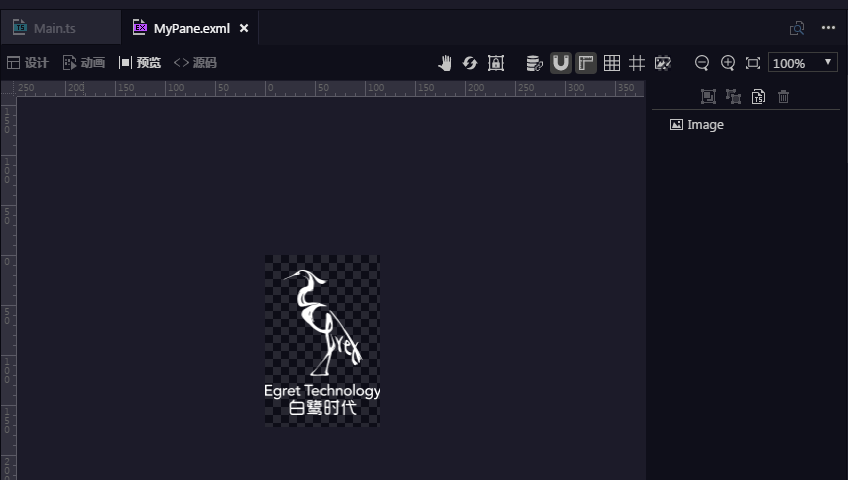
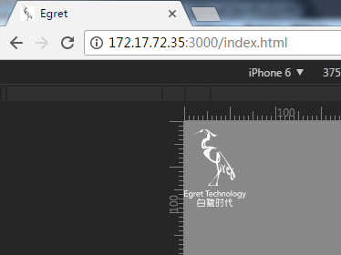

# eui初学（exml的编写、加载与事件绑定）

内容涉及

1. `exml` 编写
1. `exml` 文件加载
1. 事件绑定

## 1. 准备

### 1.1. [AssetAdapter.ts](download/AssetAdapter.ts)

> 重置 `Image.source` 的解析规则，让其能够使用预加载资源（`resource/default.res.json` 中 `preload` 定义的资源）【若为 `Egret EUI 项目`，则该文件已写好】

引入文件 [src/AssetAdapter.ts](download/AssetAdapter.ts) 后，修改 `src/Main.ts`，通常写在调用比较靠前的函数中即可：

```
public constructor() {
    ...
    egret.registerImplementation( "eui.IAssetAdapter", new AssetAdapter() );
}
```

现在 `exml` 文件的 `<e:Image source="egret_icon_png" />` 就能使用预加载的资源了（不然会报 404，加载 `http://127.0.0.1:3000/egret_icon_png` 这个错误资源）。

### 1.2. [ThemeAdapter.ts](download/ThemeAdapter.ts)

> 效果与 `AssetAdapter.ts` 相似，不过是与 `resource/default.thm.json` 搭配，从而使用预加载的 `exml` 资源【若为 `Egret EUI 项目`，则该文件已写好】

引入文件 [src/ThemeAdapter.ts](download/ThemeAdapter.ts) 后，修改 `src/Main.ts`，通常写在调用比较靠前的函数中即可：

```
public constructor() {
    ...
    egret.registerImplementation( "eui.IThemeAdapter", new ThemeAdapter() );
}
```

### 1.3 [ABDelegate.ts](download/ABDelegate.ts)

> 类似 jQuery 的 delegate 方法，对事件进行统一管理

## 2. exml 编写

### 2.1. 编写 eui 界面（非 eui.Skin 类）

> 文件路径为 `resource/eui_skins/MyPane.exml`

```
<?xml version="1.0" encoding="utf-8"?>
<e:Group class="myapp.MyPane" xmlns:e="http://ns.egret.com/eui">
    <e:Image id="myimg" source="egret_icon_png" />
</e:Group>
```



注意：

1. `class` 属性必须、必须、必须要添加！不然会重置对象的 `.d.ts` 内容。（`exml` 文件在编译时，会生成 `src/libs/exml.e.d.ts`，如果不加自定义类名，此例有可能会报错）
    ```
    declare module myapp{
        class MyPane extends eui.Group{
        }
    }
    ````
    以上为添加自定义 `class` 所生成的内容
    ```
    declare module eui{
        class Group{
        }
    }
    ```
    以上为未添加 `class` 所生成的内容，这样会覆盖 `eui.d.ts` 所定义好的内容，导致编译报错。

1. `xmlns:e` 属性用于开启 egret wing 的 exml 智能提示，但不能写在 `<?xml ... ?>` 那行

## 3. exml 加载

### 3.1. 加载资源方式 1（`EXML.load`）

```
// src/Main.ts 文件
...

private createScene() {

    EXML.load( 'resource/eui_skins/MyPane.exml', ( clazz: any, url: string ) => {

        let MyPane = clazz;
        let myPane = new MyPane();
        // 或
        // let myPane = new myapp.MyPane(); // 这个和 exml 中的 class 属性有关

        this.stage.addChild( myPane );
            
    }, this );
}
```



### 3.2. 加载资源方式 2（`resource/default.thm.json`+`eui.Theme`）

创建 `resource/default.thm.json`

```
{
  "skins": {
    "myapp.MyPane": "resource/eui_skins/MyPane.exml"
  },
  "autoGenerateExmlsList": true,
  "exmls": [
    "resource/eui_skins/MyPane.exml"
  ]
}
```

修改 `src/Main.ts`

```
private onConfigComplete( event: RES.ResourceEvent ): void {
    ...
    let theme = new eui.Theme( "resource/default.thm.json", this.stage );
    theme.addEventListener(eui.UIEvent.COMPLETE, this.onThemeLoadComplete, this);
}
private onThemeLoadComplete(): void {
    this.isThemeLoadEnd = true; // 标示已加载好主题文件
    this.createScene();
}
private onResourceLoadComplete( event: RES.ResourceEvent ): void {
    ...
    this.isResourceLoadEnd = true; // 标示已加载好资源文件
    this.createScene();
}
private createScene(){
    // 主题文件和资源文件都加载好后才正式创建界面
    if ( this.isThemeLoadEnd && this.isResourceLoadEnd ) {
        this.startCreateScene();
    }
}
/**
 * 创建场景界面
 * Create scene interface
 */
protected startCreateScene(): void {
    let myPane = new myapp.MyPane();
    this.addChild( myPane );
}
```

## 4. 事件绑定

### 4.1. 事件绑定方式 1（每个元素都绑定一个事件）

修改 `src/Main.ts`

```
protected startCreateScene(): void {

    let myPane = new myapp.MyPane();

    this.addChild( myPane );

    let myimg = myPane.myimg; // myimg 对应 ID 为 "myimg" 的元素

    myimg.addEventListener( egret.TouchEvent.TOUCH_TAP, ( evt: egret.TouchEvent ) => {
        alert( 123 );
    }, this );
}
```

或者像这样：

```
protected startCreateScene(): void {

    let myPane = new myapp.MyPane();

    this.addChild( myPane );

    let myimg = myPane.getChildAt( 0 );

    myimg.addEventListener( egret.TouchEvent.TOUCH_TAP, ( evt: egret.TouchEvent ) => {
        alert( 123 );
    }, this );
}
```

不过，编译器可能会报错，说 `myimg` 不存在，下面可选择其中一种方法解决：

1. 修改 `libs/exml.e.d.ts` 文件【不过不建议，因为此文件是自动生成的，不知道会不会在下次自动写入时清空所写内容】

    ```
    declare module myapp{
	    class MyPane extends eui.Group{
            public myimg: eui.Image
	    }
    }
    ```

1. 修改 `let myimg = myPane.myimg` 为 `let myimg:eui.Image = myPane[ 'myimg' ]`

### 4.2. 事件绑定方式 2（所有事件绑定到根元素中）

```
protected startCreateScene(): void {

    let myPane = new myapp.MyPane();

    this.addChild( myPane );

    myPane.addEventListener( egret.TouchEvent.TOUCH_TAP, ( evt: egret.TouchEvent ) => {

        switch ( evt.target ) {

            case myPane[ 'myimg' ]:

                alert( 456 );

                break;
        }

    }, this );
}
```

推荐引入文件 [ABDelegate.ts](download/ABDelegate.ts)，然后修改 `src/Main.ts` 文件：

```
protected startCreateScene(): void {

    let myPane = new myapp.MyPane();

    this.addChild( myPane );

    singleDelegate.bind(
        myPane
        , myPane[ 'myimg' ]
        , egret.TouchEvent.TOUCH_TAP
        , ( evt: egret.TouchEvent ) => { alert( 456 ) }
        , this
    );
}
```