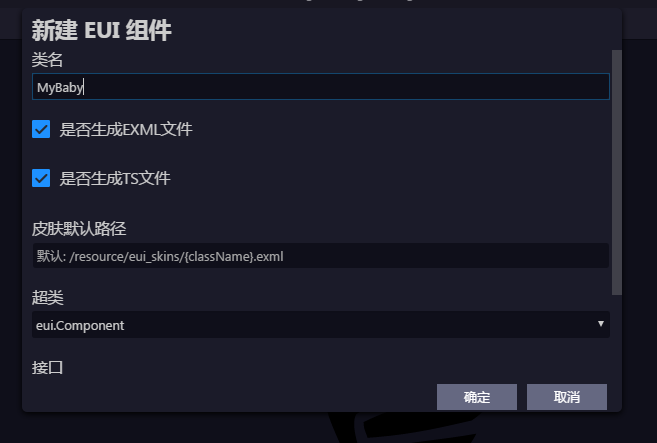
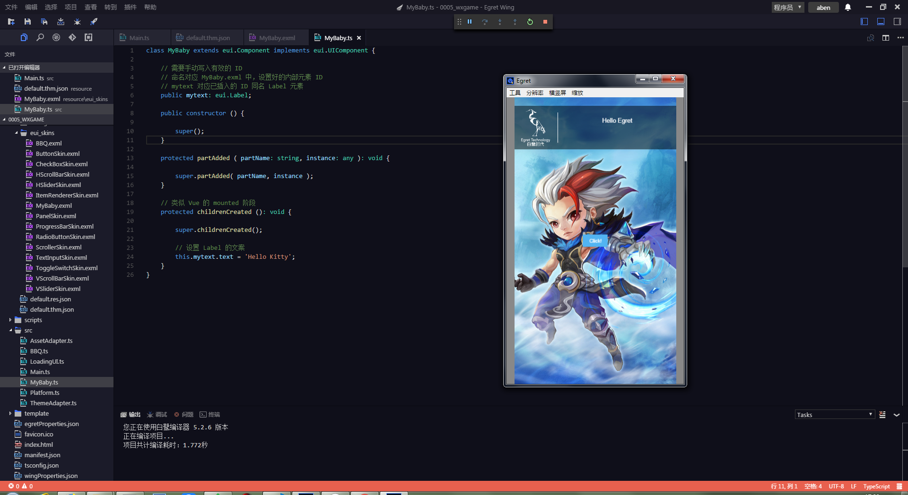

# eui新建组件操作简例

准备：

* egret wing v4.1.5
* egret core v5.2.6

## 1. 新建游戏项目或在已有游戏项目进行

项目类型选择 `Egret EUI 项目`，而不是 `Egret 游戏项目`！

## 2. 相关操作截图和说明

2.1. 右键点击 `src` 目录，选择 `新建模板文件 > 新建 EUI 组件`。【必须在该目录点击，因为生成的 `ts` 文件在其他目录会报语法错误：`eui` 不存在】

2.2. 在确认框输入该组件的类型，如 `MyBaby`。

该界面是点击 “确定” 按钮后，自动出的，并且自动做了以下事情：

* 生成 `src/MyBaby.ts`
* 生成 `resource/eui_skins/MyBaby.exml`
* `resource/default.thm.json` 的 `skins` 字段增加 `"MyBaby": "resource/eui_skins/MyBaby.exml"`

2.3. 新建该组件对应的资源文件夹 `resource/assets/MyBaby`，并放入图片资源 `header.png`。

2.4. 修改 `resource/default.res.json` 中 `resource/assets/MyBaby/header.png` 的名称为 `mybaby_header_png`。

2.5. 编辑 `MyBaby` 组件的 UI。

exml 编辑模式的界面。设置好 `MyBaby` 各项参数。

添加 `Image` 组件，并设置好各项参数。注意资源名为 `mybaby_header_png`。

将图片设置为九宫格图。

添加 `Label` 组件。注意设置其 ID 为 `mytext`。

2.6. 编辑 `MyBaby` 组件的逻辑。

修改 `src/MyBaby.ts` 文件。

修改 `src/Main.ts` 文件。点击 Debug 后，游戏出现 MyBaby 元素。

点击游戏中的 MyBaby 元素，字段会变化。

## 3. 备注

3.1. `resource/default.thm.json` 中的 `skins` 字段是存储 `类` 与 `exml` 关系的映射表。

如果将红框部分去掉。显示如下：

想要正常显示，需要在 `src/MyBaby.ts` 的构造函数添加 `this.skinName = 'resource/eui_skins/MyBaby.exml'`。

## 4. 参考

* [Egret引擎的EUI基础使用教程](https://blog.csdn.net/a727911438/article/details/53609066)
