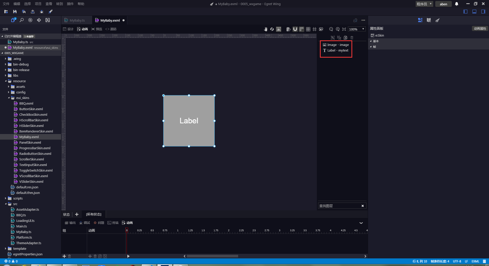
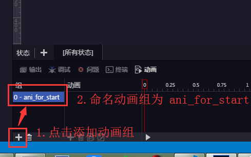
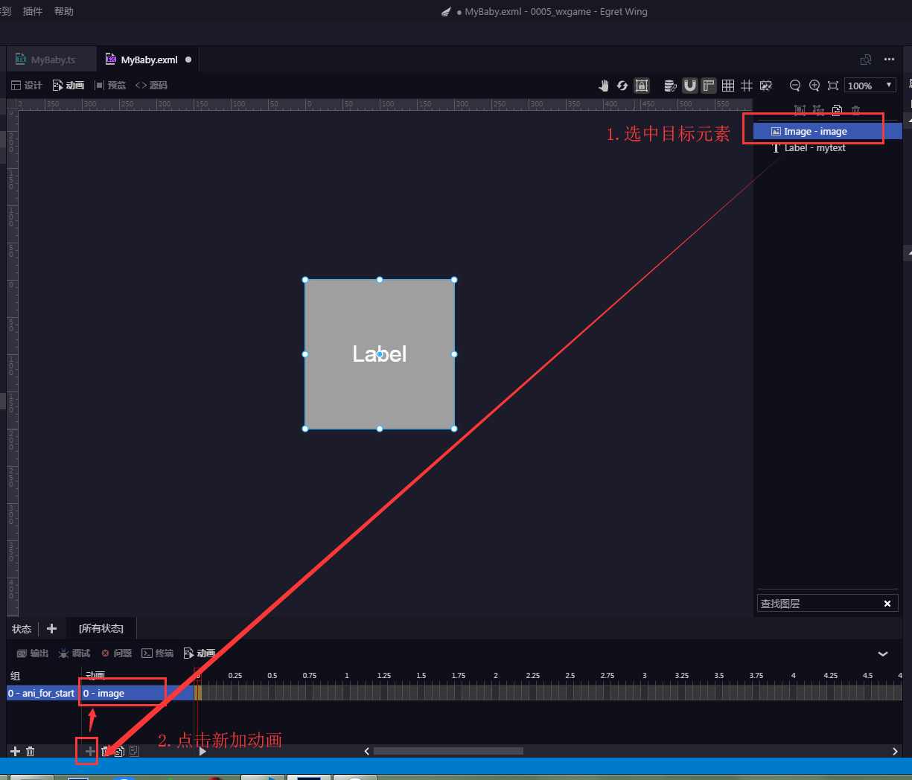
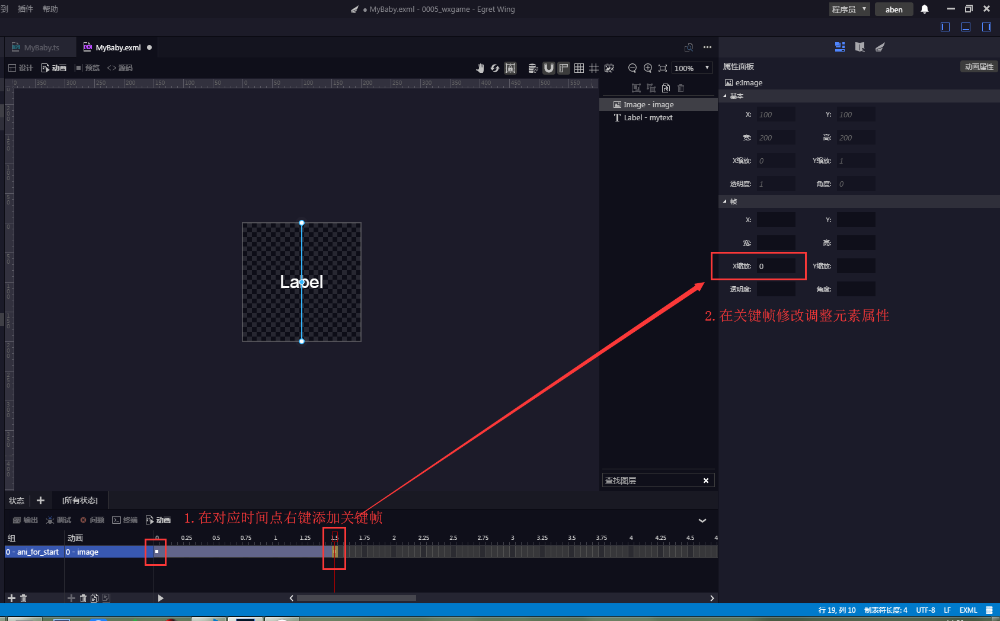
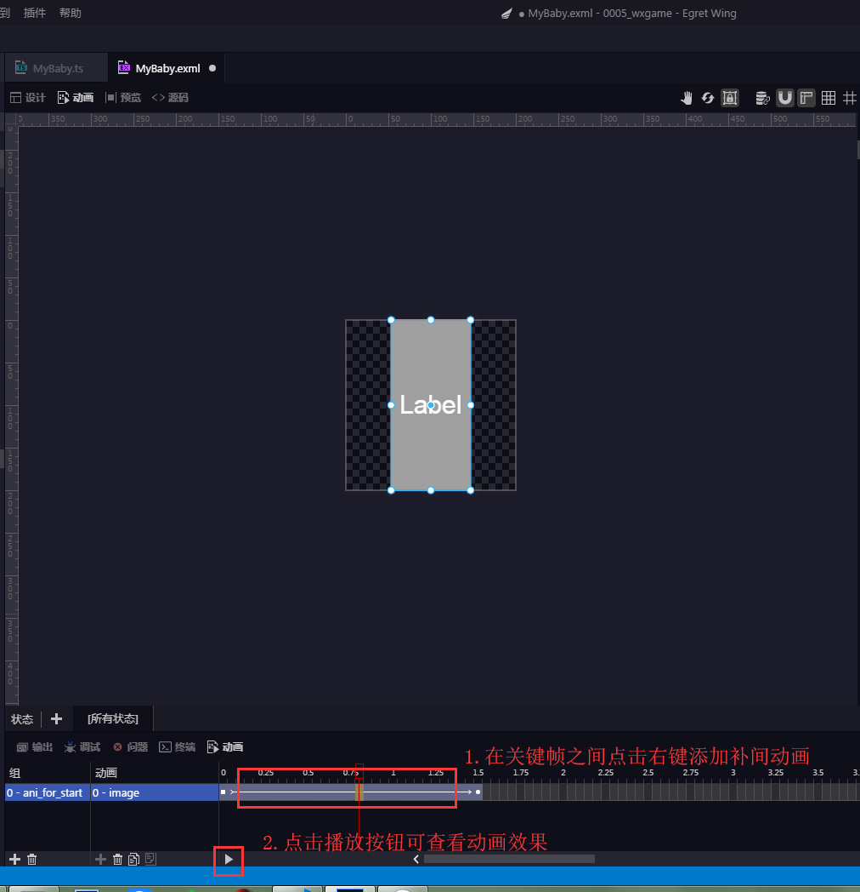
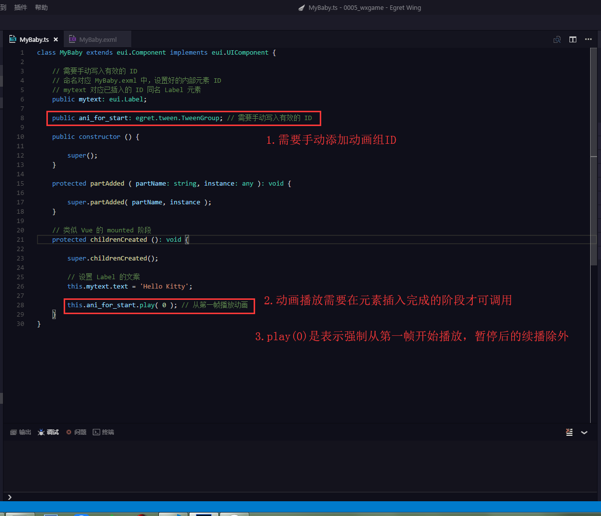
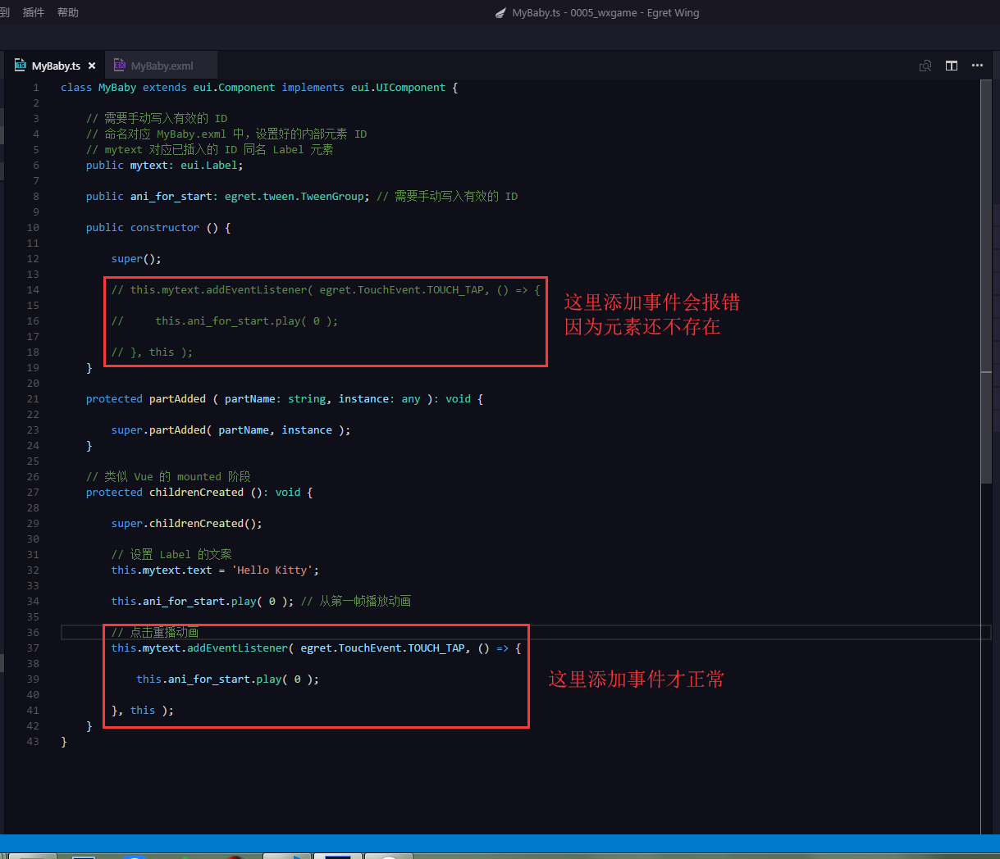
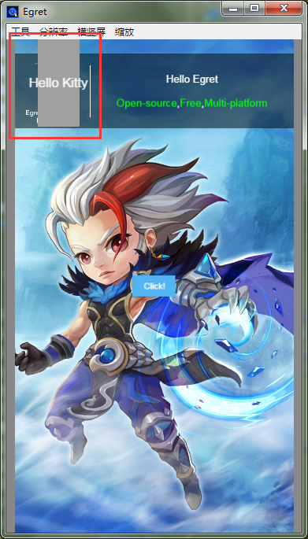

# eui新建组件操作简例

本篇延续《part0004-eui新建组件操作简例》，具体新建组件操作，请先看该文章！

准备：

* egret wing v4.1.5
* egret core v5.2.6
* 知道怎么新建 eui 组件

## 1. 新建动画（编辑 `resource/eui_skins/MyBaby.exml`）

## 2. 调用动画（编辑 `src/MyBaby.ts`）

## 3. 运行看效果

开始会播放动画，然后点击红框区域，会重新播放动画

