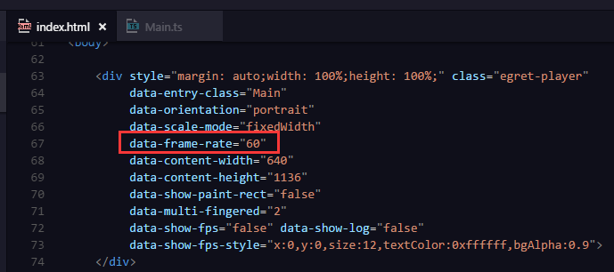

# 农场大亨重置版踩过的坑

白鹭引擎版本：4.0.3

## ❤ 提高帧率到 60，降低滚动动画卡顿



一般创建完项目后，`index.html` 文件会设置帧率为 30，即 `data-frame-rate="30"`。


如果感觉即使一个简单的滚动动画（`egret.Tween` 换成 `eui.sys.Animate` 等方法都没啥作用）都会卡顿的话（ip6s不卡，ip7+却卡。。。汗颜），调高这个大杀器的值！


经测试发现，到动画的某个过程会把帧率降低 25%~30%，如果按 30 帧进行渲染的话，卡顿会比较明显，如果提高帧率，让其低点在可接受范围内（一般人眼对 25 帧是感觉），就感觉不怎么卡了

## ❤ `cacheAsBitmap = true` 可以降低绘制数，但一定要安卓真机测，看是否能开启


`cacheAsBitmap = true` 会对运行效率有帮助，但会提高内存占用。但这里主要解释后半句。

当 `some_object.cacheAsBitmap = true` 时，在安卓机子上会出现图像没了一截或全部的情况，所以必须要一边开启，一边在安卓真机上测试。以下是遇到状况的情况：

1. `cacheAsBitmap` 区域有 x 轴或 y 轴动画

    

    大滚动不能使用

1. `cacheAsBitmap` 区域有 alpha 动画

    

    阴影不能使用

以下是不会出现不良状况的情况：

1. `cacheAsBitmap` 区域整块内容变化

    

1. `cacheAsBitmap` 区域中有一小部分有 `width` 或 `hight` 动画

    

    区域中的进度条不影响

1. `cacheAsBitmap` 区域在 `eui.Scroller` 中不会因回弹动画而影响

## 单 `egret.Shape` 绘制多色多图形的不良反应

主要是会影响单个 `egret.Shape` 使用不同颜色绘制多个图形

```
let shape = new egret.Shape();

shape.graphics.beginFill( 0xb86f3a );
shape.graphics.drawRect( 0, 0, 640, 28 );
shape.graphics.endFill();
shape.graphics.beginFill( 0xf9cb82 );
shape.graphics.drawRect( 0, 0 + 28, 640, 4 );
shape.graphics.endFill();
shape.graphics.beginFill( 0xdaa26c );
shape.graphics.drawRect( 0, 0 + 28 + 4, 640, 4 );
shape.graphics.endFill();
shape.graphics.beginFill( 0xfcd09a );
shape.graphics.drawRect( 0, 0 + 28 + 4 + 4, 640, 60 );
shape.graphics.endFill();
...
```

这样会出现全部区域就填充最后一种颜色，在渲染模式为 `canvas` 下尤为明显（pc 和手机都出现），`webgl` 会在 pc chrome 出现（手机却没事）。

骚年，改用图片（`egret.Bitmap` 或 `eui.Image`）吧！

## `eui.Image` 不能获取宽高，而 `egret.Bitmap` 可以获取宽高

## `eui.Scroller` 的滚动起效，必须有 `eui` 的元素（如 `eui.Image`、`eui.Label`），而不能全是 `egret` 的元素（如 `egret.Bitmap`、`egret.TextField` 等）

## 调试输出使用 `egret.log` 而不是 `console.log`

`egret.log` 具有 `console.log` 的效果，还能在 `data-show-log="true"` 时，在屏幕打印消息

## `if ( DEBUG ) { ... }` 的内容不会存在在发版文件中

## `eui.sys.Animate` 的事例

针对单属性可使用 `eui.sys.Animate`，`eui.Scroller` 的回弹动画就是用这滴

```
let fn_ing      = ( animate: eui.sys.Animation ) => { console.log( animate.currentValue ) };
let fn_final    = () => { console.log( '完了' ) };
let d_ani       = new eui.sys.Animation( fn_ing, this );

d_ani.from = 500;
d_ani.to = 100;
d_ani.duration = 2000;
d_ani.endFunction = fn_final;
d_ani.play();
```