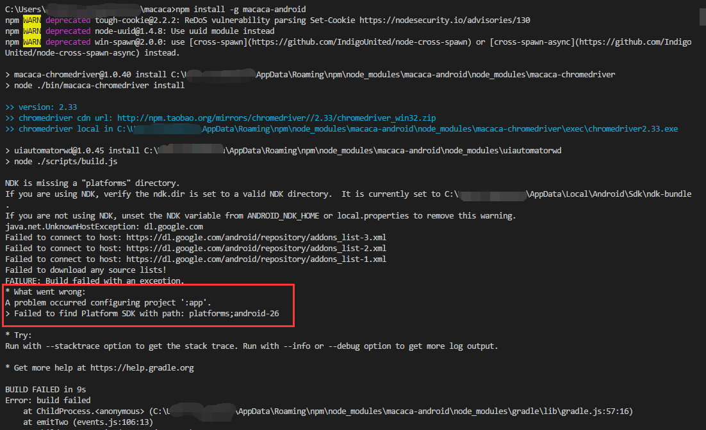
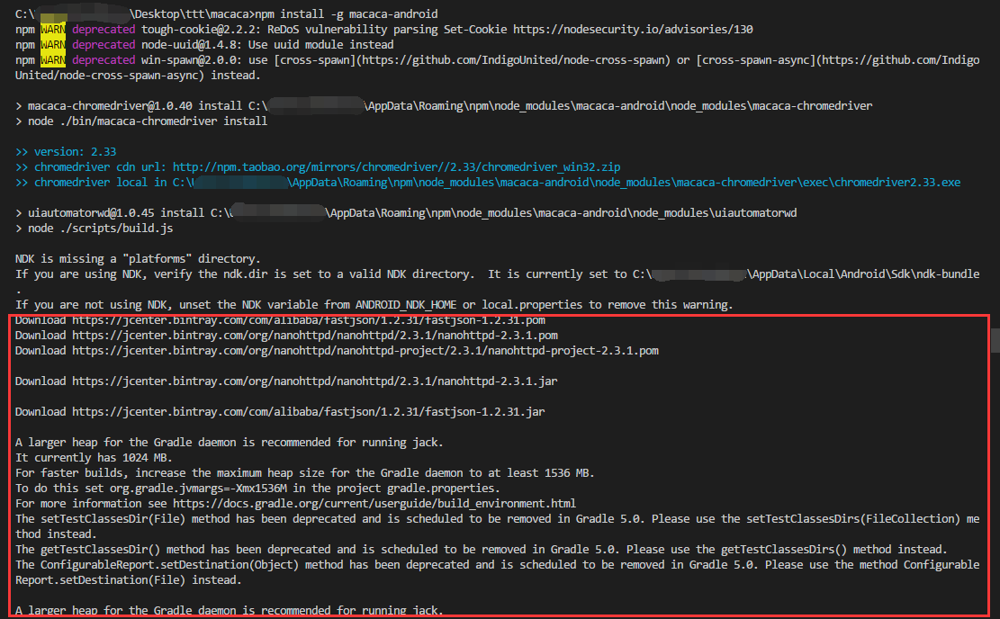
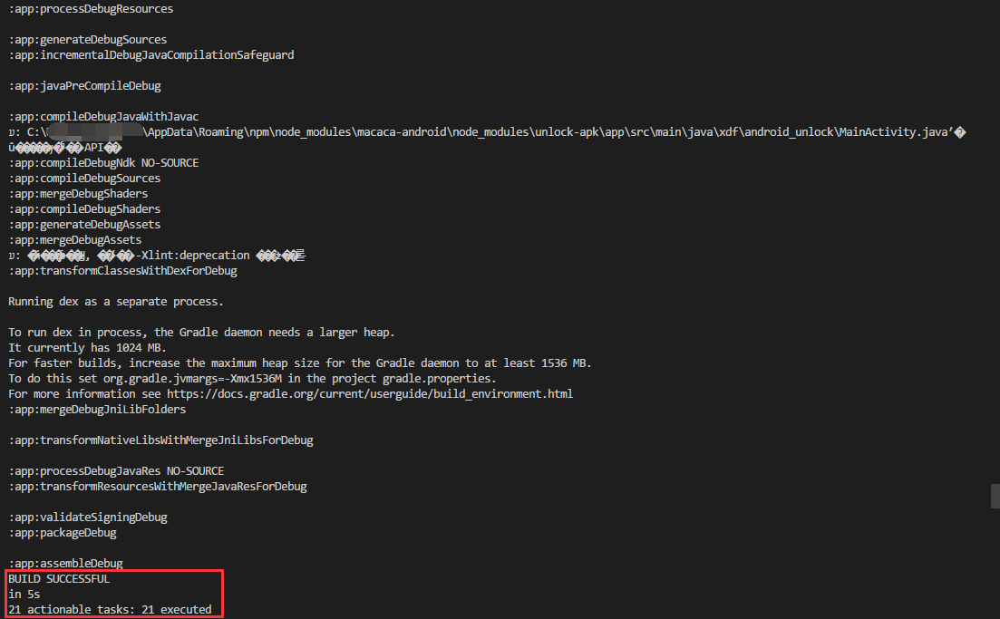
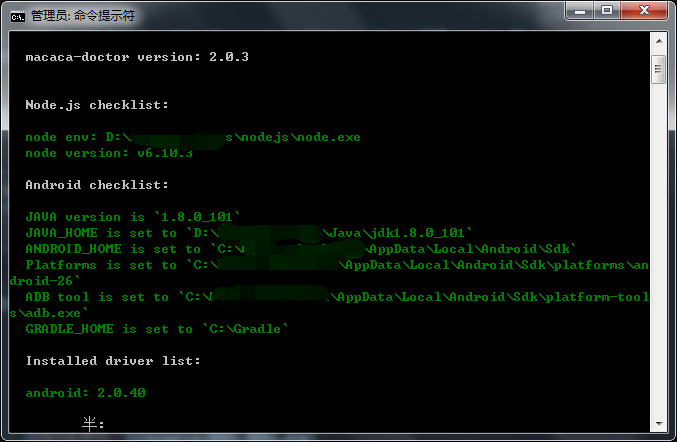
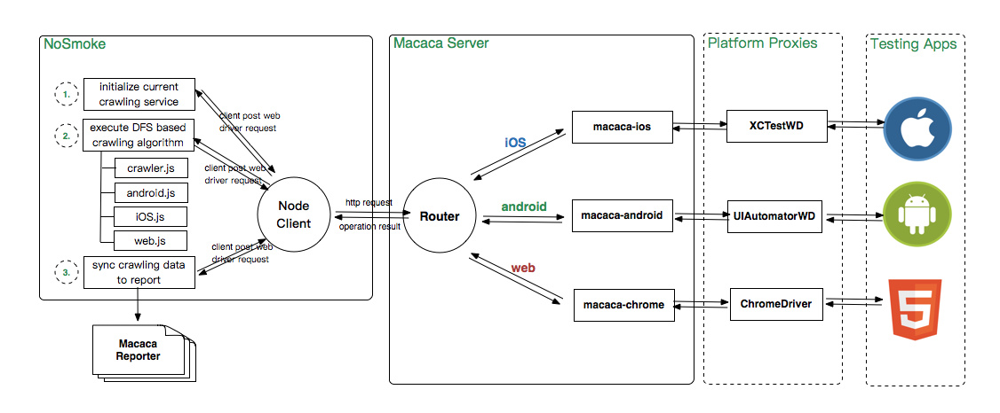
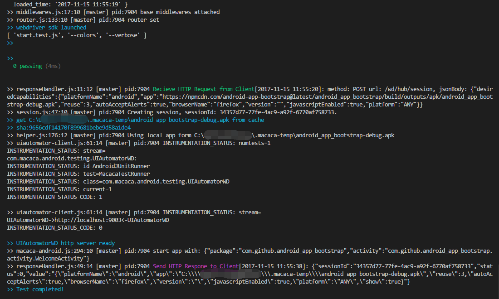
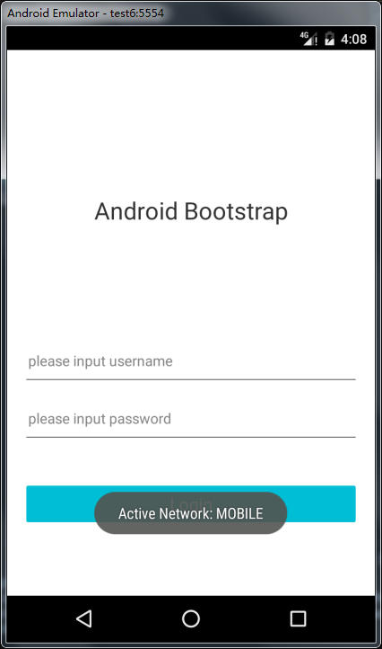

# Macaca 安卓环境配置

如果按照官网[《环境配置》](https://macacajs.github.io/zh/environment-setup)一节不能成功运行测试用例的话，请看下面的操作。。。

1. [安装 Nodejs](https://nodejs.org/)

1. [安装 Java](http://www.oracle.com/technetwork/java/javase/downloads/jdk8-downloads-2133151.html) 并配置 `Path`、`JAVA_HOME`

1. [安装完整 Android Studio](http://www.android-studio.org/) 或单独安装 [Android SDK](http://tools.android-studio.org/index.php/sdk)并配置 `PATH`、`ANDROID_HOME`

1. 由于 `Android SDK` 装包被墙，请参考[此文](https://www.cnblogs.com/firstcsharp/p/4381262.html)配置镜像

1. 必须安装 `Tools/Android SDK Build-tools 25.0.2`、`Extras/Android Support Repository`【最高版本】、`Android 8.0.0(API 26)/SDK Platform 26`（安卓开发所需的包，如 `Tools/Android SDK Tools`、`Tools/Android SDK Platform-tools`、`Extras/Google USB Driver`、`Extras/Intel x86 Emulator Accelerator(HAXM installer)` 等请确保装上，具体请自行度娘，或参看[此文](https://www.cnblogs.com/kangjianwei101/p/5621238.html)）

1. [安装 Gradle](https://gradle.org/install/#manually)（下载 gradle 的压缩包，解压到 C 盘的新建文件夹 Gradle），配置 `PATH`、`GRADLE_HOME`

1. [安装 Ant](http://ant.apache.org/bindownload.cgi)（下载 ant 的压缩包，解压到 C 盘的新建文件夹 Ant），配置 `PATH`、`ANT_HOME`、`CLASSPATH`（为 `%ANT_HOME%\lib`）

1. 配置 `CHROMEDRIVER_CDNURL`（为 `http://npm.taobao.org/mirrors/chromedriver/`）、`ELECTRON_MIRROR`（为 `https://npm.taobao.org/mirrors/electron/`）

1. `npm i -g macaca-cli`，安装成功会有只猴子的面孔出现

1. `npm i -g macaca-android`，这一步要注意，很有可能会安装成功，但编译安卓包失败，如果失败，请 `npm uninstall -g macaca-android` 后重新再来：

    * 编译失败，要根据错误提示，在 `Android SDK` 升级或安装对应的包，前提是不要被墙
    

    * 编译成功
    
    

1. 命令行执行 `macaca doctor`，如果 `Node.js checklist` 和 `Android checklist` 显示都是绿的话，那证明所需的硬性条件达标，`Installed driver list` 要有对应测试平台的 driver（苹果是 `macaca-ios`，安卓是 `macaca-android`，PC是 `macaca-electron`）

    

参考：

* [Macaca 关于 macaca 升级安卓最新驱动后，执行用例报错遇到的问题解决分享 ](https://testerhome.com/topics/8659)

* [Macaca ubuntu16.04 和 win10 环境正确部署 macaca-android2.0.2 和 app-inspector1.2.28](https://testerhome.com/topics/8618Android)

* [Android SDK镜像的介绍使用【转发】](https://www.cnblogs.com/firstcsharp/p/4381262.html)

* [Macaca Macaca 自动化框架 [Python 系列]](https://testerhome.com/topics/7898)

提要：

* 如果 `macaca-android` 安装不成功，那之后想 `npm i app-inspector -g` 也不会成功，基本上因为编译不成功导致的 “不完全成功”

* 执行完 `app-inspector -u 91QXXXXXXEFE` 后，切换 app 界面，浏览器刷新才能看到最新的界面

## Macaca 的架构图

[来源](https://macacajs.github.io/zh/nosmoke)



npm 安装的 `macaca-cli` 大概对应的是 `Macaca Server` 的 Router 部分，`macaca-android` 对应 `macaca-android` 和 `UIAutomatorWD`（`UIAutomator` 的 `Web Driver` 封装）

## 第一个测试用例

1. 创建文件夹 `android-test`，并 `cd` 到该目录

1. 命令行执行 `npm init`，一直按 `Enter` 键，生成 `package.json`

1. 命令行执行 `npm i --save mocha macaca-wd`

1. 写测试用例 `start.test.js`

    ```
    let wd = require( 'macaca-wd' );

    let driver = wd.promiseChainRemote( {
        host : 'localhost',
        port : 3456,
    } );

    let desiredCaps = {
        platformName: 'android',
        // udid : '91QXXXXXXEFE', // 真机对应的设备 ID，通过 "adb devices" 命令查看
        app : 'https://npmcdn.com/android-app-bootstrap@latest/android_app_bootstrap/build/outputs/apk/android_app_bootstrap-debug.apk',
        reuse : 3, // 在测试结束后保持 app 状态
        autoAcceptAlerts : true, // 自动接受所有的系统弹窗信息
    };

    driver.init( desiredCaps );
    ```

1. 打开模拟器或 usb 链接手机（手机记得打开允许 usb 调试手机选项）

1. 命令行执行 `macaca run -d start.test.js --werbose`

    

1. 如果成功执行，会在模拟器/手机上，安装上 `android-unlock.apk`，并安装和打开 `android_app_bootstrap-debug.apk`，测试用例执行完，大概会停留在以下界面

    

提要：

* `desiredCaps` 更多参数请参考[《参数设置》](https://macacajs.github.io/zh/helpful-settings)

* 本人在 avd 模拟器只能顺利实现官网的测试 apk——bootstrap，但真机可以安装并打开其他 apk

* 真机测试，需要手动点一些权限确定的弹窗

* `macaca run` 会用 `mocha` 的环境去运行测试用例，所以 `describe`、`it`、`before`、`after` 等是全局函数，更多请看[官网](http://mochajs.org/)或[《测试框架 Mocha 实例教程》](http://www.ruanyifeng.com/blog/2015/12/a-mocha-tutorial-of-examples.html)

## 第二个测试用例

```
let wd = require( 'macaca-wd' );

let driver = wd.promiseChainRemote( {
    host : 'localhost',
    port : 3456,
} );

let desiredCaps = {
    platformName: 'android',
    // udid : '91QXXXXXXEFE', // 真机需要对应的设备 ID
    app : 'https://npmcdn.com/android-app-bootstrap@latest/android_app_bootstrap/build/outputs/apk/android_app_bootstrap-debug.apk',
}

describe( '简答测试', function() {

    it( '随便', function( done ) {

        this.timeout( 50 * 1000 );

        return driver
            .init( desiredCaps )
            .sleep( 10 * 1000 )
            .waitForElementsByClassName( 'android.widget.EditText' )
            .then( ( eles ) => {
                return eles[ 0 ];
            } )
            .sendKeys( '123' )
            .sleep( 1000 )
            .then( done )
            ;
    } );
} );
```

## 真机测试 Fail，模拟器测试 Success！

魅族 pro6 （系统貌似是 Android 6.0）真机测试会报 `Process crashed`、`Calling from not trusted UID!` 错误，类似[这个错误](https://github.com/alibaba/macaca/issues/731)，暂未找到解决办法。

模拟器（AVD 的 Android 6.0，API 23）可以执行上面的测试用例，还有[官方示例的前大部分](https://github.com/macaca-sample/sample-nodejs/blob/master/macaca-test/mobile-app-sample.test.js)。