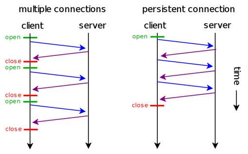
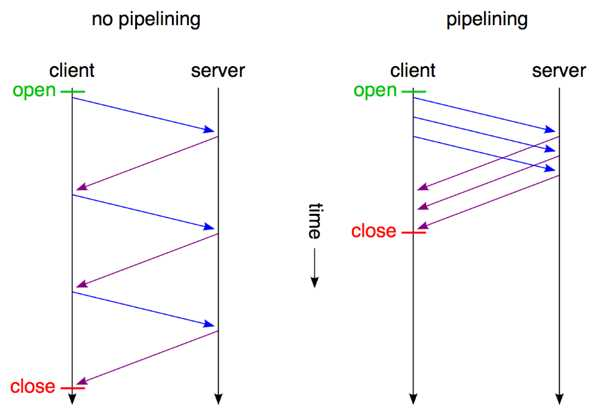
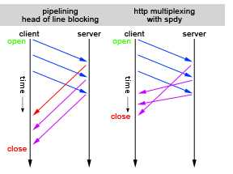

# Socket

## 名称解析

来自知乎二大王的回答

> HTTP是无连接的是什么鬼说法，应该是短连接吧？然而实际上“HTTP=短连接”早就已经是过去式了
>
> HTTP连接方式的进化史：
>
> **HTTP/0.9时代：短连接**
>
> 每个HTTP请求都要经历一次DNS解析、三次握手、传输和四次挥手。反复创建和断开TCP连接的开销巨大，在现在看来，这种传输方式简直是糟糕透顶。
>
> **HTTP/1.0时代：持久连接概念提出**
>
> 人们认识到短连接的弊端，提出了持久连接的概念，在HTTP/1.0中得到了初步的支持。
>
> 持久连接，即一个TCP连接服务多次请求：
>
> 客户端在请求header中携带 `Connection: Keep-Alive`，即是在向服务端请求持久连接。如果服务端接受持久连接，则会在响应header中同样携带 `Connection: Keep-Alive`，这样客户端便会继续使用同一个TCP连接发送接下来的若干请求。（`Keep-Alive` 的默认参数是 `[timout=5, max=100]`，即一个 TCP 连接可以服务至多 5 秒内的 100 次请求）
>
> 当服务端主动切断一个持久连接时（或服务端不支持持久连接），则会在 header 中携带 `Connection: Close`，要求客户端停止使用这一连接。
> 
> 
>
> **HTTP/1.1时代：持久连接成为默认的连接方式；提出pipelining概念**
>
> HTTP/1.1开始，即使请求header中没有携带 `Connection: Keep-Alive`，传输也会默认以持久连接的方式进行。
>
> 目前所有的浏览器都默认请求持久连接，几乎所有的HTTP服务端也都默认开启对持久连接的支持，短连接正式成为过去式。（HTTP/1.1的发布时间是1997年，最后一次对协议的补充是在1999年，我们可以夸张地说：HTTP短连接这个概念已经过时了近20年了。）
>
> 同时，持久连接的弊端被提出 —— HOLB（Head of Line Blocking）
>
> 即持久连接下一个连接中的请求仍然是串行的，如果某个请求出现网络阻塞等问题，会导致同一条连接上的后续请求被阻塞。
>
> 所以 HTTP/1.1 中提出了 pipelining 概念，即客户端可以在一个请求发送完成后不等待响应便直接发起第二个请求，服务端在返回响应时会按请求到达的顺序依次返回，这样就极大地降低了延迟。
>
> 
>
> 然而 pipelining 并没有彻底解决 HOLB，为了让同一个连接中的多个响应能够和多个请求匹配上，响应仍然是按请求的顺序串行返回的。所以 pipelining 并没有被广泛接受，几乎所有代理服务都不支持 pipelining，部分浏览器不支持 pipelining，支持的大部分也会将其默认关闭。
>
> **SPDY和HTTP/2：multiplexing**
>
> multiplexing 即多路复用，在 SPDY 中提出，同时也在 HTTP/2 中实现。
> multiplexing 技术能够让多个请求和响应的传输完全混杂在一起进行，通过 streamId 来互相区别。这彻底解决了 holb 问题，同时还允许给每个请求设置优先级，服务端会先响应优先级高的请求。
>
> 
>
> 现在 Chrome、FireFox、Opera、IE、Safari 的最新版本都支持 SPDY，Nginx/Apache/HTTPD/Jetty/Tomcat 等服务端也都提供了对 SPDY的支持。另外，谷歌已经关闭 SPDY 项目，正式为 HTTP/2 让路。可以认为 SPDY 是 HTTP/2 的前身和探路者。

## 依赖

* `http`

## 参考文档

* [怎么理解TCP是面向连接的，HTTP基于TCP却是无连接的？](https://www.zhihu.com/question/51996213)