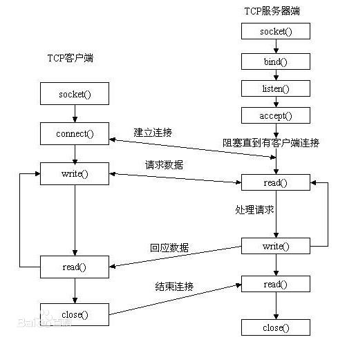

# Socket

## 名称解析

> 通常称作"套接字"，用于描述IP地址和端口，是一个通信链的句柄，可以用来实现不同虚拟机或不同计算机之间的通信。

> * 就是两个进程，跨计算机，他俩需要通讯的话，需要通过网络对接起来。
这就是 socket 的作用。
> * 打个比方吧，两个进程在两个计算机上，需要有一个进程做被动方，叫做服务器。
> * 另一个做主动方，叫做客户端。
> * 他们位于某个计算机上，叫做主机 host ，在网络上有自己的 ip 地址。
> * 一个计算机上可以有多个进程作为服务器，但是 ip 每个机器只有一个，所以通过不同的 port 数字加以区分。
> * 因此，服务器程序需要绑定在本机的某个端口号上。客户端需要声明自己连接哪个地址的那个端口。两个进程通过网络建立起通讯渠道，然后就可以通过 recv send 来收发一些信息，完成通讯。

## 依赖

* `net`

## WebSocket

通讯前：

1. 客户端发送 `upgrade: 'websocket'` 和 `sec-websocket-key` 编码内容的头信息。

1. 服务端返回 `101` 的协议切换状态，和 `sec-websocket-key` 与 websocket 公钥（`"258EAFA5-E914-47DA-95CA-C5AB0DC85B11"`）的加密编码内容 `Sec-WebSocket-Accept`。

1. 客户端验证通过后，双方可进行 websocket 通讯。

通讯时：

1. WebSocket 通讯依照 RFC6455 规范，客户端与服务端之间发送和接收均为二进制数据，但浏览器会帮手解析，故难点在服务端对接收数据（截取、解密、解码）和发送数据（编码、加密、拼接）的处理。示例，[服务端](demo/socket/t1-server.js)、[客户端](demo/socket/t1-client.html)。

1. 客户端发送给服务端的数据，如果被原样返回给客户端，客户端会校验失败（masked 位校验失败），导致通讯失败，请注意【nodejs 官方例子 `socket.pipe( socket )` 是错误的】。

1. 客户端会每隔一段时间 ping 服务端（心跳检测），如果一段时间都没返回的话，主动断绝，所以，服务端需要用 pong 去回复。

通讯末：

1. 服务端 close 会发送信号给客户端，使其 close，error 同理。

未完待续...

* [细说WebSocket - Node篇](http://www.cnblogs.com/hustskyking/p/websocket-with-node.html)

* [WebSocket帧数据 解码/转码](http://www.bubuko.com/infodetail-1607510.html)

* [websocket 通信协议(已更新到version 13)](http://www.zendstudio.net/archives/websocket-protocol/)

* [socket.io，理解socket.io](http://www.cnblogs.com/xiezhengcai/p/3957314.html)

* [nodejs实现Websocket的数据接收发送](https://www.cnblogs.com/axes/p/4514199.html)，这个写 websocket 接收发送的过程比较详细些

## 参考文档

* [学习 NodeJS 第八天：Socket 通讯](http://blog.csdn.net/zhangxin09/article/details/12844975)

* [Node.js开发入门—套接字(socket)编程](http://blog.csdn.net/foruok/article/details/48434277)

* [Linux 下 socket 编程有什么需要注意的？](https://www.zhihu.com/question/20154815)，Socket的概念说得很仔细，建议看