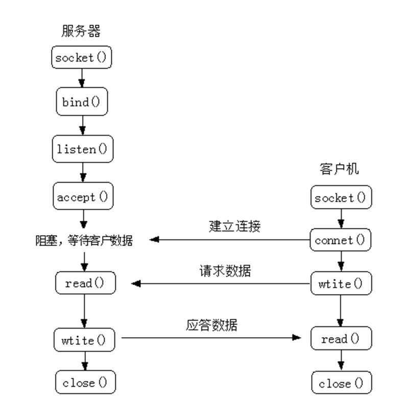
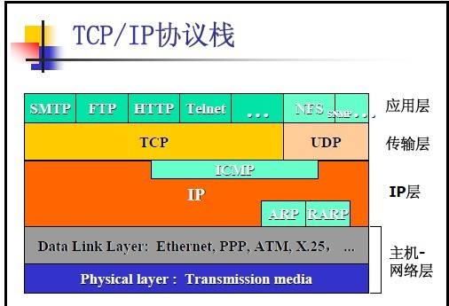

# UDP 开发实例





## 名词解释：UDP

> UDP 是 User Datagram Protocol 的简称， 中文名是用户数据报协议。
>
> OSI（Open System Interconnection，开放式系统互联）参考模型中的一种无连接传输层协议。
>
> 面向事务，简单但不可靠信息的传送服务。不提供数据包分组、组装和不能对数据包进行排序的缺点，即当报文发送之后，是无法得知其是否安全完整到达的。
>
> UDP 和 TCP 都属于传输层协议。
>
> 在数据传输过程中延迟小、数据传输效率高，适合对可靠性要求不高的应用程序，或者可以保障可靠性的应用程序，如 DNS、TFTP、SNMP 等。亦应用于视频、音频、普通数据的传输，如 ICQ、QQ 聊天。

## 简例

客户端（随机 IP）

```
let mod_dgram = require( 'dgram' );

let d_client = mod_dgram.createSocket( 'udp4' );

d_client.send( 'hi server', 41234, '127.0.0.1' );

d_client.on( 'message', ( msg, info ) => {

  console.info( `*** get message : ${msg} from ${info.address}:${info.port}` );

  console.info( 'client know server has got the message' );

} );
```

服务端（固定 IP）

```
let mod_dgram = require( 'dgram' );

let d_server = mod_dgram.createSocket( 'udp4' );

d_server.on( 'listening', () => {

  let d_address = d_server.address();
  
  console.info( `+++ server is listening to ${d_address.address}:${d_address.port}` );

} );

d_server.on( 'message', ( msg, info ) => {

  console.info( `*** get message : ${msg} from ${info.address}:${info.port}` );

  d_server.send( 'I got message! from server', info.port, info.address );

} );

d_server.bind( 41234 );
```

## 参考文档

* [UDP](https://baike.baidu.com/item/UDP/571511?fr=aladdin)，基本认识

* [UDP / Datagram Sockets](https://nodejs.org/dist/latest-v6.x/docs/api/dgram.html)，nodejs 官网对 udp 模块 api 的说明

* [详细分析Node.js中的UDP模块](http://blog.csdn.net/liangklfang/article/details/51169763)，含给 api 的中文翻译