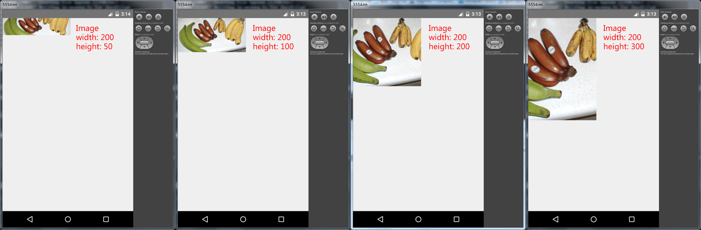
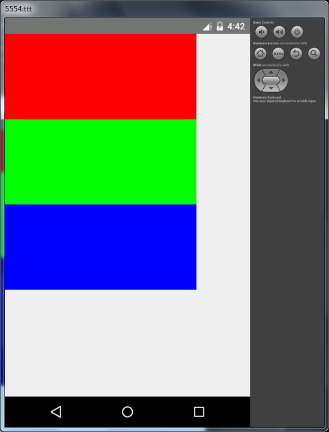
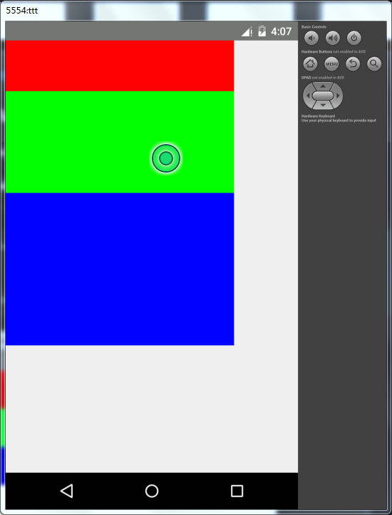
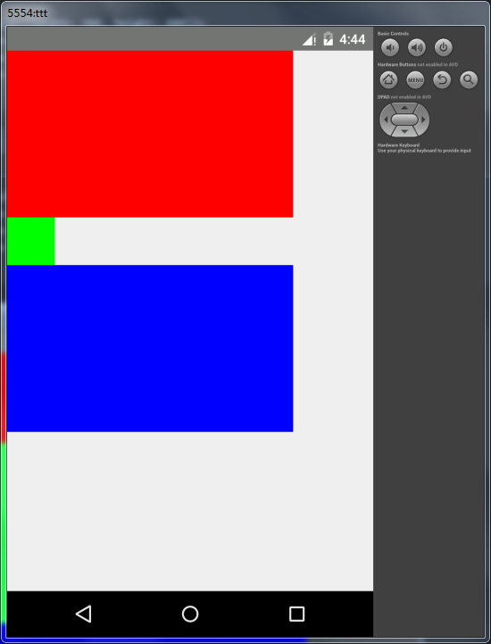
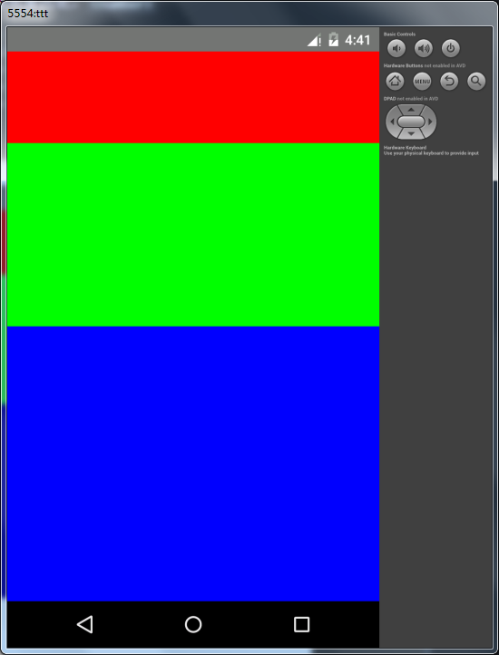
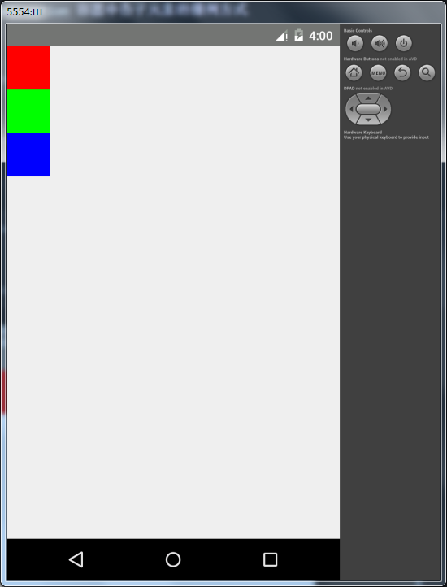
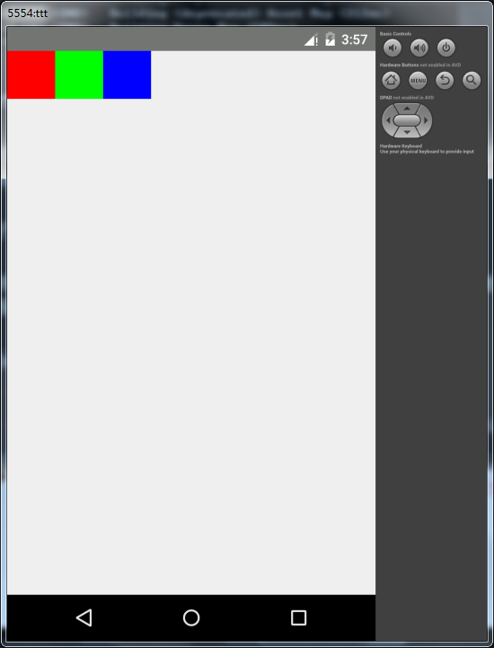
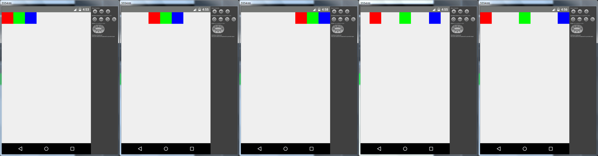
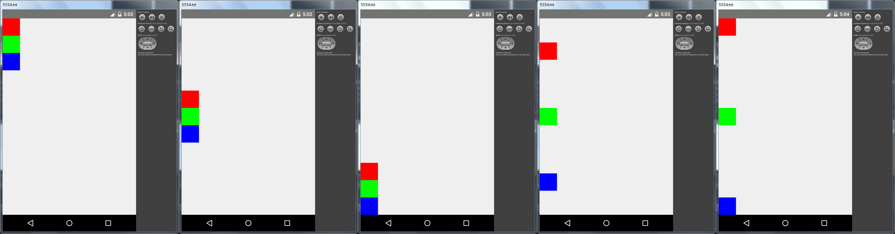
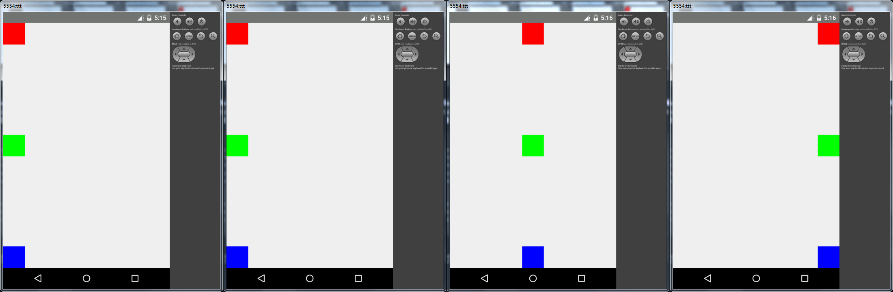

## Part：程序

### > 对可视元素（如 `View` `Image` `ScrollView` 等）必须定义宽高或 `flex` 样式，因为默认宽高均为 `0`

### > 子元素不能撑大父元素

### > 样式的值，如果写错了（类型错、写了不存在的值等），就会红屏报错

### > `Image` 组件

* 为块元素，会独占一行，多图片平铺一行可以使用 `flex` 布局

* `Image` 可以理解为带 `background` 样式的 `div` 元素，其背景一定会居中占满，不会留白



[原图地址](https://upload.wikimedia.org/wikipedia/commons/d/de/Bananavarieties.jpg)

### > FlexBox 布局

#### `flex` 同级元素占比：`<number>`

```
<View style={{width: 300, height: 400}}>
    <View style={{flex: 1, backgroundColor: '#f00'}} />
    <View style={{flex: 1, backgroundColor: '#0f0'}} />
    <View style={{flex: 1, backgroundColor: '#00f'}} />
</View>
```



```
<View style={{width: 300, height: 400}}>
    <View style={{flex: 1, backgroundColor: '#f00'}} />
    <View style={{flex: 2, backgroundColor: '#0f0'}} />
    <View style={{flex: 3, backgroundColor: '#00f'}} />
</View>
```



```
<View style={{width: 300, height: 400}}>
    <View style={{flex: 1, backgroundColor: '#f00'}} />
    <View style={{width: 50, height: 50, backgroundColor: '#0f0'}} />
    <View style={{flex: 1, backgroundColor: '#00f'}} />
</View>
```



```
<View style={{flex: 1}}>
    <View style={{flex: 1, backgroundColor: '#f00'}} />
    <View style={{flex: 2, backgroundColor: '#0f0'}} />
    <View style={{flex: 3, backgroundColor: '#00f'}} />
</View>
```



#### `flexDirection` 容器中各子元素的排列方式（或叫主轴方向）：`column` `row`【默认为 `column`】

* `column` ：垂直排列

```
<View style={{flex: 1, flexDirection: 'column'}}>
    <View style={{width: 50,height: 50, backgroundColor: '#f00'}} />
    <View style={{width: 50,height: 50, backgroundColor: '#0f0'}} />
    <View style={{width: 50,height: 50, backgroundColor: '#00f'}} />
</View>
```



* `row` ：水平排列

```
<View style={{flex: 1, flexDirection: 'row'}}>
    <View style={{width: 50,height: 50, backgroundColor: '#f00'}} />
    <View style={{width: 50,height: 50, backgroundColor: '#0f0'}} />
    <View style={{width: 50,height: 50, backgroundColor: '#00f'}} />
</View>
```



#### `justifyContent` 子元素沿主轴的定位：`flex-start` `center` `flex-end` `space-around` `space-between`【默认为 `flex-start`】

```
<View style={{flex: 1, flexDirection: 'row', justifyContent: '<flex-start|center|flex-end|space-around|space-between>'}}>
    <View style={{width: 50,height: 50, backgroundColor: '#f00'}} />
    <View style={{width: 50,height: 50, backgroundColor: '#0f0'}} />
    <View style={{width: 50,height: 50, backgroundColor: '#00f'}} />
</View>
```



从左到右依次为：`flex-start` `center` `flex-end` `space-around` `space-between`

```
<View style={{flex: 1, flexDirection: 'column', justifyContent: '<flex-start|center|flex-end|space-around|space-between>'}}>
    <View style={{width: 50,height: 50, backgroundColor: '#f00'}} />
    <View style={{width: 50,height: 50, backgroundColor: '#0f0'}} />
    <View style={{width: 50,height: 50, backgroundColor: '#00f'}} />
</View>
```



从左到右依次为：`flex-start` `center` `flex-end` `space-around` `space-between`

#### `alignItems` 子元素沿着次轴（与主轴垂直的轴，比如若主轴方向为 `row`，则次轴方向为 `column`）的排列方式：`flex-start` `center` `flex-end` `stretch`【默认为 `stretch`】

```
<View
    style={{
        flex            : 1,
        flexDirection   : 'column',
        justifyContent  : 'space-between',
        alignItems      : '<stretch|flex-start|center|flex-end>',
    }}
>
    <View style={{width: 50,height: 50, backgroundColor: '#f00'}} />
    <View style={{width: 50,height: 50, backgroundColor: '#0f0'}} />
    <View style={{width: 50,height: 50, backgroundColor: '#00f'}} />
</View>
```



从左到右依次为：`stretch` `flex-start` `center` `flex-end`

## 文章收集

暂无
