# 二学

下面基于 `v6.3.1` 的 `RxJs` 编辑

## 分类表格

### 创建类

| 名称 | 位置 | 图示
|------|-----|-----
| `create`      | `rxjs.Observable.create`  | 
| `defer`       | `rxjs.defer`              | 
| `empty`       | `rxjs.empty`              | 
| `never`       | `rxjs.never`              | 
| `throwError`  | `rxjs.throwError`         | 
| `from`        | `rxjs.from`               | 
| `interval`    | `rxjs.interval`           | 
| `range`       | `rxjs.range`              | 
| `repeat`      | `rxjs.operators.repeat`   | 
| `timer`       | `rxjs.timer`              | 

### 转化类

| 名称 | 位置 | 图示
|------|-----|-----
| `buffer`          | `rxjs.operators.buffer`       | 
| `bufferCount`     | `rxjs.operators.bufferCount`  | --
| `bufferTime`      | `rxjs.operators.bufferTime`   | --
| `bufferToggle`    | `rxjs.operators.bufferToggle` | --
| `bufferWhen`      | `rxjs.operators.bufferWhen`   | --
| `flatMap`         | `rxjs.operators.flatMap`      | 
| `groupBy`         | `rxjs.operators.groupBy`      | 
| `map`             | `rxjs.operators.map`          | 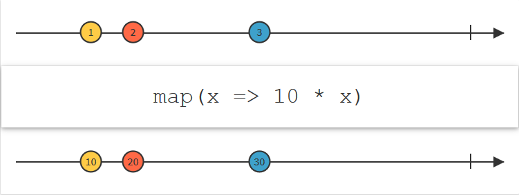
| `scan`            | `rxjs.operators.scan`         | 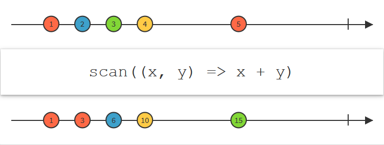
| `window`          | `rxjs.operators.window`       | 
| `windowCount`     | `rxjs.operators.windowCount`  | --
| `windowTime`      | `rxjs.operators.windowTime`   | --
| `windowToggle`    | `rxjs.operators.windowToggle` | --
| `windowWhen`      | `rxjs.operators.windowWhen`   | --

### 过滤类

| 名称 | 位置 | 图示
|------|-----|-----
| `debounce`                | `rxjs.operators.debounce`                 | 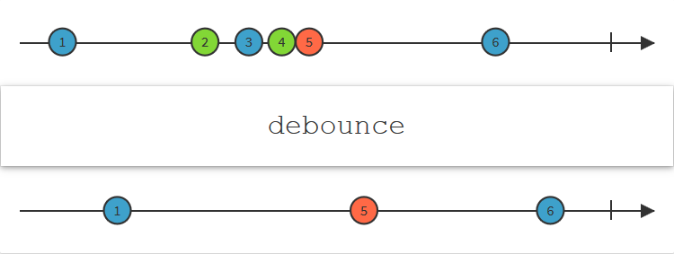
| `debounceTime`            | `rxjs.operators.debounceTime`             | --
| `distinct`                | `rxjs.operators.distinct`                 | 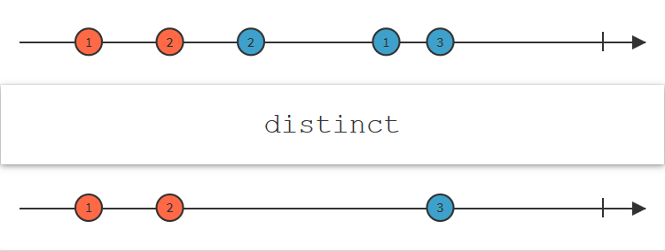
| `distinctUntilChanged`    | `rxjs.operators.distinctUntilChanged`     | --
| `distinctUntilKeyChanged` | `rxjs.operators.distinctUntilKeyChanged`  | --
| `elementAt`               | `rxjs.operators.elementAt`                | 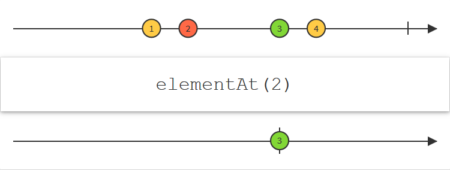
| `filter`                  | `rxjs.operators.filter`                   | 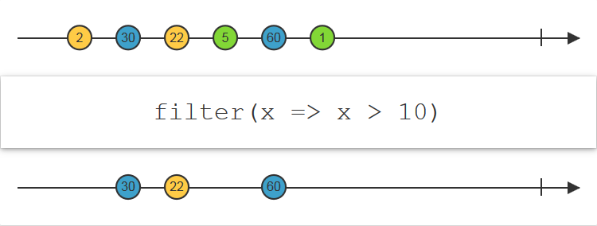
| `first`                   | `rxjs.operators.first`                    | 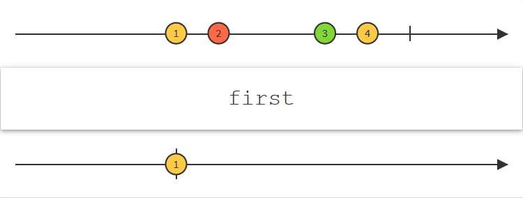
| `ignoreElements`          | `rxjs.operators.ignoreElements`           | 
| `last`                    | `rxjs.operators.last`                     | 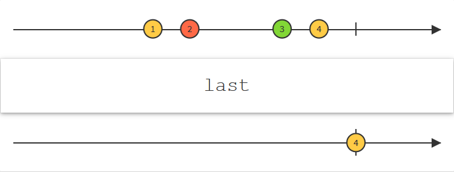
| `sample`                  | `rxjs.operators.sample`                   | 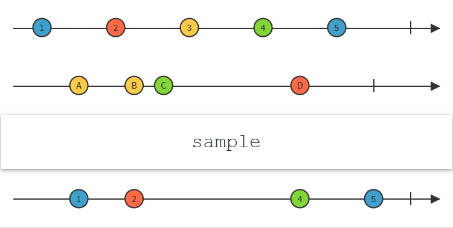
| `skip`                    | `rxjs.operators.skip`                     | 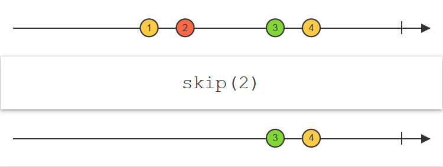
| `skipLast`                | `rxjs.operators.skipLast`                 | 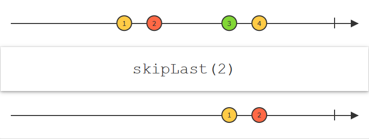
| `take`                    | `rxjs.operators.take`                     | 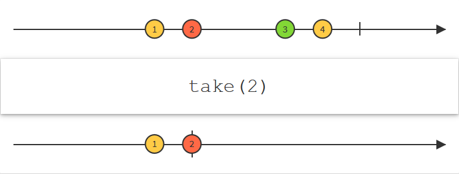
| `takeLast`                | `rxjs.operators.takeLast`                 | 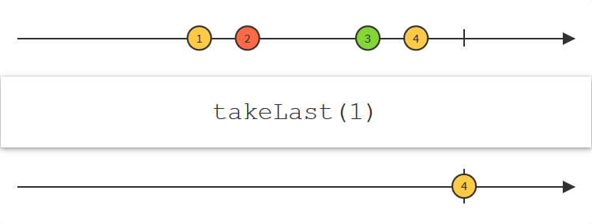
| `switchMap`               | `rxjs.operators.switchMap`                | --

### 合并类

| 名称 | 位置 | 图示
|------|-----|-----
| `combineLatest`   | `rxjs.operators.combineLatest`    | 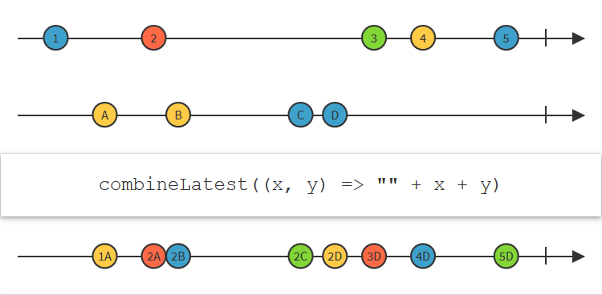
| `merge`           | `rxjs.operators.merge`            | 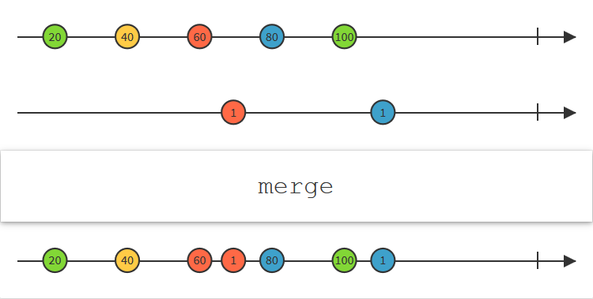
| `startWith`       | `rxjs.operators.startWith`        | 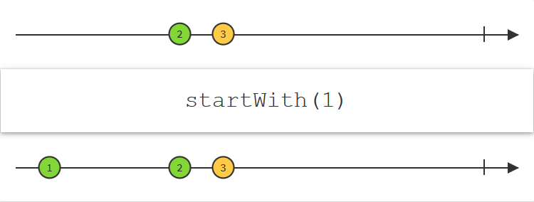
| `switchAll`       | `rxjs.operators.switchAll`        | 
| `exhaust`         | `rxjs.operators.exhaust`          | --
| `zip`             | `rxjs.operators.zip`              | 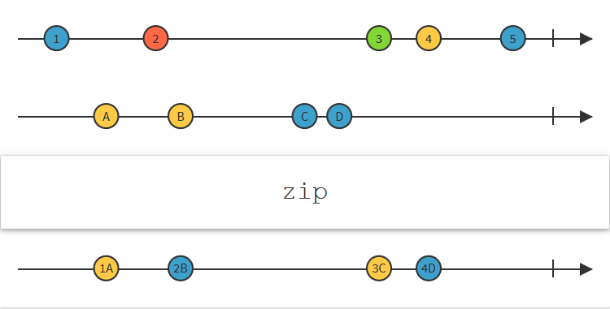
| `zipAll`          | `rxjs.operators.zipAll`           | --

### 异常类

| 名称 | 位置 | 图示
|------|-----|-----
| `catchError`  | `rxjs.operators.catchError`   | 
| `retry`       | `rxjs.operators.retry`        | 
| `retryWhen`   | `rxjs.operators.retryWhen`    | --

## 参考

* [Operators By Category](http://reactivex.io/documentation/operators.html)
