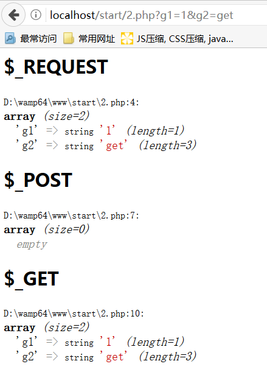
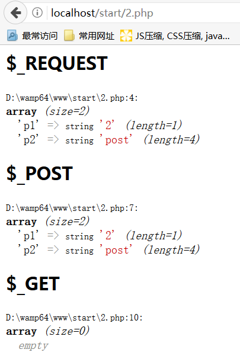
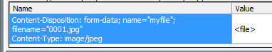

# 基础

来源：[PHP 教程](http://www.runoob.com/php/php-tutorial.html)

## 类的两种写法

```
<?php

/**
 * 类，基本写法 1
 */
class One
{
    var $name = "One";

    function say() {

        // 方法内存在 $this 对象，不存在 self，parent 对象

        return $this->name;
    }

    function sayHi() {

        return "Hi ".$this->say();
    }
}

$one = new One();

echo $one->name;    // "One"
echo "<br>";
echo $one->say();   // "One"
echo "<br>";
echo $one->sayHi(); // "Hi One"


/**
 * 类，基本写法 2
 */
class Two
{
    public $normalProp = "normalProp"; // 或 var $normalProp = "normalProp"

    public static $staticProp = "staticProp";

    function normalMethod() {

        return "normalMethod";
    }

    public static function staticMethod() {

        return "staticMethod";
    }

    function normalCall() {

        // return $this->normalProp." by normalCall";      // ok
        // return $this->normalMethod()." by normalCall";  // ok
        // return self::$staticProp." by normalCall";      // ok
        // return self::staticMethod()." by normalCall";   // ok
    }

    public static function staticCall() {

        // return $this->normalProp." by staticCall";      // 报错 “Fatal error: Using $this when not in object context in...”
        // return $this->normalMethod()." by staticCall";  // 报错 “Fatal error: Using $this when not in object context in...”
        // return self::$staticProp." by staticCall";      // ok
        // return self::staticMethod()." by staticCall";   // ok
    }
}

$two = new Two();

echo $two->normalProp;
echo "<br>";
echo $two::$staticProp;
echo "<br>";
echo $two->normalMethod();
echo "<br>";
echo $two::staticMethod();
echo "<br>";
echo $two->normalCall();
echo "<br>";
echo $two::staticCall();

?>
```

总结：

* 调用静态变量和方法用 `::`
* 调用普通变量和方法用 `->`
* 静态方法只能使用静态变量和方法，但普通方法能调用普通与静态的变量和方法

## $_REQUEST = $_POST + $_GET

`2.html`

```
...
    <h2>仅有 GET 参数</h2>
    <a href="2.php?g1=1&g2=a">跳转</a>

    <h2>仅有 POST 参数</h2>
    <form action="2.php" method="POST">
        <input type="text" name="b1" value="2">
        <input type="text" name="b2" value="b">
        <button type="submit">提交</button>
    </form>

    <h2>具有 GET 和 POST 参数</h2>
    <form action="2.php?a1=1&a2=a" method="POST">
        <input type="text" name="b1" value="2">
        <input type="text" name="b2" value="b">
        <button type="submit">提交</button>
    </form>
...
```

`2.php`

```
<?php

echo '<h2>$_REQUEST</h2>';
var_dump( $_REQUEST );

echo '<h2>$_POST</h2>';
var_dump( $_POST );

echo '<h2>$_GET</h2>';
var_dump( $_GET );

?>
```

仅有 GET 参数



仅有 POST 参数



具有 GET 和 POST 参数


> 使用 $_REGUEST 可以不区分参数类型，但对于上线来说，未必好

如果是上传文件的话，需要 `$_FILES` 才能获取到上传文件

## 正则表达式

```
if ( !preg_match( "/^\w*$/", "abcd  efgh" ) ) {

    $nameErr = "只允许字母和空格"; 
}
```

说明：

* preg_match 返回 1 则是匹配成功，0 则是匹配失败

* 正则表达式与前端正则相通

## 双引号字符能输出变量，单引号字符不能输出变量

```
$name = "我的名字";

echo "$name"."\n"; // 我的名字
echo '$name'."\n"; // $name

$content = "呼叫$name";

echo $content."\n"; // 呼叫我的名字

$content = '呼叫$name';

echo $content."\n"; // 呼叫$name
```

使用时请注意，场景使用的 `$` 是用于变量符号，还是普通字符。

## 转义字符（`htmlspecialchars`）

```
echo htmlspecialchars( "&" );   // &amp;
echo "\n";
echo htmlspecialchars( "\"" );  // &quot;
echo "\n";
echo htmlspecialchars( "'" );   // '
                                // 与官网给出的 &#039; 不符，请注意
echo "\n";
echo htmlspecialchars( "<" );   // &lt;
echo "\n";
echo htmlspecialchars( ">" );   // &gt;
```

## 去反斜杠（`stripslashes`）

## 单行与多行字符串（`'...'`或`"..."`）

```
<?php

echo '
a<br>
b<br>
\'<br>
\"<br>
';

echo "
c<br>
d<br>
\'<br>
\"<br>
";

?>
```

注意：

* `'...'` 内含有 `\"` 会输出 `\"`，而不是 `"`，双引号嵌入单引号同理

## 打印

* `print` 仅打印字符串，不能打印对象，总返回 1

* `echo` 与 `print` 相似，但没有返回值，可以 `echo "I ", "am ", "hungry"` 这样使用，速度更快

* `var_dump` 含有文件名、行号、数据类型等，可打印数组、关联数组、实例等信息

## 程序中断（`exit( init )` 或 `die()`）

## 关联数组（类似前端的 `Object`）

```
<?php

$myarr = array( "name" => "小芳", "female" => true, "age" => 10 );

var_dump( $myarr );
// D:\wamp64\www\start\4.php:23:
// array (size=3)
//   'name' => string '小芳' (length=6)
//   'female' => boolean true
//   'age' => int 10

echo $myarr[ "name" ]; // "小芳"

$myarr[ "birthday" ] = date( "Y年m月d日" );

echo $myarr[ "birthday" ]; // "2017年06月12日"

?>
```

使用 `for ( $array as $key=>$val ) { ... }` 方式进行遍历

> 感觉 php 的数组其实是链表

## 上传文件（`$_FILES`）

`5.html`

```
...
    <form action="5.php" method="post" enctype="multipart/form-data">
        <label for="myfile">我的文件</label>
        <input type="file" name="myfile" id="myfile" />
        <input type="submit" value="提交" />
    </form>
...
```

点击按钮上传的数据



`5.php`

```
<?php

var_dump( $_FILES[ "myfile" ] );
// D:\wamp64\www\start\5.php:3:
// array (size=5)
//   'name' => string '0001.jpg' (length=8)
//   'type' => string 'image/jpeg' (length=10)
//   'tmp_name' => string 'D:\wamp64\tmp\php459D.tmp' (length=25)
//   'error' => int 0
//   'size' => int 66137

?>
```

属性说明：

* `name` 上传的文件名，由客户端上传数据 `Content-Disposition` 中的 `filename` 参数决定
* `type` MIME 数据类型，由客户端上传数据 `Content-Type` 参数决定
* `tmp_name` 上传后的临时文件的绝对路径地址（当 5.php 执行完，缓存文件会没了）
* `error` 客户端上传时的错误码，大于 `0` 则证明上传失败
* `size` 文件大小，单位为 byte，如 `66137 / 1024 ≈ 64.5 kb`

`5.php` 改

```
<?php

var_dump( $_FILES[ "myfile" ] );

$myfile         = $_FILES[ "myfile" ];
$myfile_name    = $myfile[ "name" ]; // "0001.jpg"
$myfile_tmp     = $myfile[ "tmp_name" ];
$myfile_temp    = explode( ".", $myfile_name ); // array( "0001", "jpg" )
$myfile_ext     = end( $myfile_temp ); // "jpg"
$newfile_name   = "myfile_copy".".$myfile_ext"; // "myfile_copy.jpg"

if ( $myfile[ "error" ] > 0 ) {

    // 文件上传错误

} else {

    if ( file_exists( $newfile_name ) ) {

        // 如果文件已存在

    } else {

        // 复制临时文件到 5.php 同级位置
        move_uploaded_file( $myfile_tmp, $newfile_name );
    }
}

?>
```

## Cookie 操作（`$_COOKIE`）

* 设置 cookie，如 `setcookie( "user", "Mike", time() + 3600 )`（3600 秒之后才过期）

* 清除 cookie，如 `setcookie( "user", "", time() - 3600 )`

* 读取 cookie，如 `$_COOKIE[ "user" ]`

## Session 操作（`$_SESSION`）

```
<?php

session_start();

// 存储 session 数据
$_SESSION[ "views" ] = 1;

if( isset( $_SESSION[ "views" ] ) ) {

	$_SESSION[ "views" ] = $_SESSION[ "views" ] + 1;

} else {

	$_SESSION[ "views" ] = 1;
}

echo "浏览量：". $_SESSION[ "views" ];

?>

<html>
<body>

<?php

if( isset( $_SESSION[ "views" ] ) ) {

    // 删除 session 的 views 字段
	unset( $_SESSION[ "views" ] );
}

// 销毁 session
session_destroy();

?>

</body>
</html>
```

大概的执行思路：

1. 执行 `session_start()`，生成唯一 key（如 `g144vap5fam0q7v5ge3mfr2f46`），并将此值写入 `cookie` 的 `PHPSESSID` 中，然后生成缓存文件 `wamp64/tmp/sess_g144vap5fam0q7v5ge3mfr2f46`（可以通过 `php.ini` 文件中的 `session.save_path` 指定）

1. 执行 `$_SESSION[ "views" ] = 1`，向缓存文件写入 `views|i:1;`

1. 执行 `unset( $_SESSION[ "views" ] )`，清空缓存文件对应的键值

1. 执行 `session_destroy()`，删除缓存文件，但不清除 `cookie` 的 `PHPSESSID` 值！

## AJAX

`8.html`

```
...
    <a id="send" href="javascript:;">发送 AJAX</a>
    <textarea name="reback" id="reback" cols="30" rows="10"></textarea>

    <script>
        function f_ajax() {

            var n_ajax = new XMLHttpRequest();

            n_ajax.addEventListener( "readystatechange", function() {

                if ( n_ajax.readyState === 4 && n_ajax.status === 200 ) {

                    // 将后端返回的数据，展示到 textarea 中
                    document.getElementById( "reback" ).value = n_ajax.responseText;
                }

            }, false );

            n_ajax.open( "GET", "8.php?from=Mike", true );

            n_ajax.send();
        };

        // 点击 “发送 AJAX” 发送数据
        document.getElementById( "send" ).addEventListener( "click", f_ajax, false );
    </script>
...
```

`8.php`

```
<?php

$from = $_REQUEST[ "from" ];
$time = array( "from" => $from, "time" => time() );

echo json_encode( $time );

?>
```

展示效果


## 最简 RESTful

目录结构

```
www
|
|- start
|   |
|   |- .htaccess
|   `- 9.php
|
`- index.php
```

`www/.htaccess`
```
# 开启 rewrite 功能
Options +FollowSymlinks
RewriteEngine on

# 重写规则
RewriteRule ^site/list/$   9.php?view=all [nc,qsa]
RewriteRule ^site/list/([0-9]+)/$   9.php?view=single&id=$1 [nc,qsa]
```

`www/9.php`
```
<?php

var_dump( $_REQUEST );

?>
```

`http://localhost/start/site/list/` 效果


`http://localhost/start/site/list/10/` 效果


匹配失败的会报 404 错误。

## `@`：屏蔽错误输出

```
class Test {

    public function withError() {

        throw "My Error";
    }

    public function noError() {

        @$this->withError(); // 屏蔽错误信息
    }
}

$test = new Test();

$test->withError(); // 报错了
$test->noError(); // 不会报错
```
