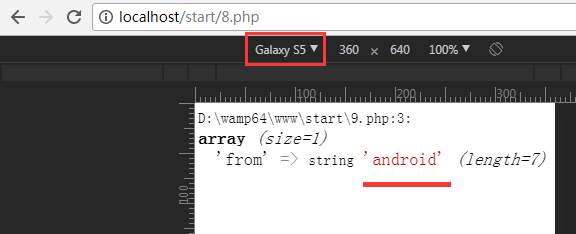
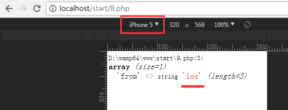
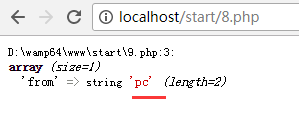

# htacess 文件简说

参考：

* [htaccess](http://baike.baidu.com/link?url=V-eoNK-2xx3SPMIfLYQ54cb1GWj4w80ZiWiyAjS-_LubY4092XWbUPKOuvloX4s0cnQT52roKgK7EUxygE1F1kD720r6mzZwXXibbfj31Xm)

* [apache开启.htaccess及.htaccess的使用方法](http://www.jb51.net/article/25476.htm)

* [URL重写：RewriteCond指令与RewriteRule 指令格式](http://blog.csdn.net/expleeve/article/details/6621885/)

## 解释

1. `.htaccess` 文件针对（当前）目录的各种请求进行配置。

1. 可以通过 Apache 下的 `httpd.conf` 文件的 `AllowOverride` 指令进行配置，其中如下：
    ```
    DocumentRoot "${INSTALL_DIR}/www"
    <Directory "${INSTALL_DIR}/www/">
        #
        # Possible values for the Options directive are "None", "All",
        # or any combination of:
        #   Indexes Includes FollowSymLinks SymLinksifOwnerMatch ExecCGI MultiViews
        #
        # Note that "MultiViews" must be named *explicitly* --- "Options All"
        # doesn't give it to you.
        #
        # The Options directive is both complicated and important.  Please see
        # http://httpd.apache.org/docs/2.4/mod/core.html#options
        # for more information.
        #
        Options +Indexes +FollowSymLinks +Multiviews

        #
        # AllowOverride controls what directives may be placed in .htaccess files.
        # It can be "All", "None", or any combination of the keywords:
        #   AllowOverride FileInfo AuthConfig Limit
        #
        AllowOverride all

        #
        # Controls who can get stuff from this server.
        #

    #   onlineoffline tag - don't remove
        Require local
    </Directory>
    ```

1. `.htaccess` 其实是 `httpd.conf` 的子配置文件，能够覆盖 `httpd.conf` 对应的配置；同理，当访问子文件夹相关请求时（如 `http://localhost/parent/child/`），父文件夹中的 `.htaccess`，也能被子文件夹中的 `.htaccess` 的配置所覆盖。

1. 能够实现：文件夹密码保护、用户自动重定向、自定义错误页面、改变你的文件扩展名、封禁特定IP地址的用户、只允许特定IP地址的用户、禁止目录列表，以及使用其他文件作为index文件等一些功能。

1. 编码格式为 `ACSII`，里面有中文提示的话（注释的话，则没所谓），请注意！

1. 缺点：
    * 维护难：当有 N 多个目录，每个目录下都有 `.htaccess` 文件，将很难进行准确配置。
    * 安全性低：如果不进行配置，非授权用户能够获取 `.htaccess` 文件。
    * 性能低：当启用了 `AllowOverride`，每个访问请求都会在每个相关的目录，查找是否有 `.htaccess` 文件（`httpd.conf` 的配置仅要加载一次即可）。

## 事例

### RESTful 请求 

`www/start/.htaccess`

```
# 开启 rewrite 功能
Options +FollowSymlinks
RewriteEngine on

# 重写规则
RewriteRule ^site/list/$   9.php?view=all [nc,qsa]
RewriteRule ^site/list/([0-9]+)/$   9.php?view=single&id=$1 [nc,qsa]
```

`www/start/9.php`

```
<?php

var_dump( $_REQUEST );

?>
```

`http://localhost/start/site/list/` 效果


`http://localhost/start/site/list/10/` 效果


匹配失败的会报 404 错误。

### 错误页面

`www/start/.htaccess`

```
# 可以直接写提示字段
ErrorDocument 404 "OMG, your page has gone?!"

# 路径的话，必须是绝对路径，不然会认为是普通字段，直接打印出来
ErrorDocument 500 /errors/500.html
```

`http://localhost/start/none.php` 效果


### `RewriteCond` + `RewriteRule` 的搭配使用说明

`www/start/.htaccess`

```
RewriteEngine on

RewriteCond %{HTTP_USER_AGENT}  iPhone|iPad|iPod|iWatch
RewriteRule 8.php               9.php?from=ios

RewriteCond %{HTTP_USER_AGENT}  Android\s
RewriteRule 8.php               9.php?from=android

RewriteRule 8.php               9.php?from=pc
```

说明：

* 第 3、4 行：如果 `User-Agent` 含有 `iPhone`、`iPad`、`iPod`、`iWatch` 字段，去访问 `8.php`，会重定向到 `9.php?from=ios`
* 第 6、7 行：如果 `User-Agent` 含有 `Android` 字段，去访问 `8.php`，会重定向到 `9.php?from=android`
* 第 9 行：访问 `8.php`，会重定向到 `9.php?from=android`

`www/start/8.php`，文件必须有，内容可为空

`www/start/9.php`

```
<?php

var_dump( $_REQUEST );

?>
```







### 防盗链

`www/start/.htaccess`

```
RewriteEngine on
RewriteCond %{HTTP_REFERER} !^$
RewriteCond %{HTTP_REFERER} !^http://(www.)?mydomain.com/.*$ [NC]
RewriteRule .(gif|jpg)$ - [F] 
```

说明：

* 第 2 行：如果 `Referer` 非空
* 第 3 行：而且 `Referer` 非 `http://mydomain.com/` 或 `http://www.mydomain.com/` 的相关链接（`[NC]` 即忽略大小写）
* 第 4 行：如果上面都为真，那么后缀为 `.gif` 或 `.jpg` 的文件的访问，会返回 `403 Forbidden`（`[F]` 会返回 `403`，而前面的 `-` 可以理解为提示 `嘿，后面还有内容哟！`）
