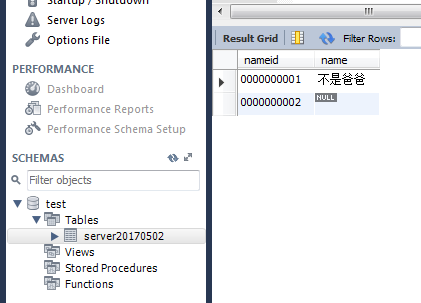

# 数据库连接简说

参考：

* [PHP PDO](http://www.runoob.com/php/php-pdo.html)

## 事例

`www/start/10.php`

```
$dbms   = 'mysql';      // 数据库类型
$host   = 'localhost';  // 数据库主机名
$dbName = 'test';       // 使用的数据库
$user   = 'root';       // 数据库连接用户名
$pwd    = 'suzhuobin';  // 对应的密码
$dsn    = "$dbms:host=$host;dbname=$dbName";

try {

    $dbh = new PDO( $dsn, $user, $pwd ); // 初始化一个PDO对象

    // 默认不是长连接，如果需要数据库长连接，需要最后加一个参数：array(PDO::ATTR_PERSISTENT => true) 变成这样：
    // $db = new PDO( $dsn, $user, $pwd, array( PDO::ATTR_PERSISTENT => true ) );

    echo "连接成功<br/>";

    // 搜索操作
    foreach( $dbh->query( 'SELECT * from server20170502' ) as $row ) {

        print_r( $row ); // 你可以用 echo( $GLOBAL ); 来看到这些值
    }

    $dbh = null; // 运行完成，关闭连接

} catch ( PDOException $e ) {

    die ( "Error!: " . $e->getMessage() . "<br/>" );
}
```

页面效果：


数据库：

