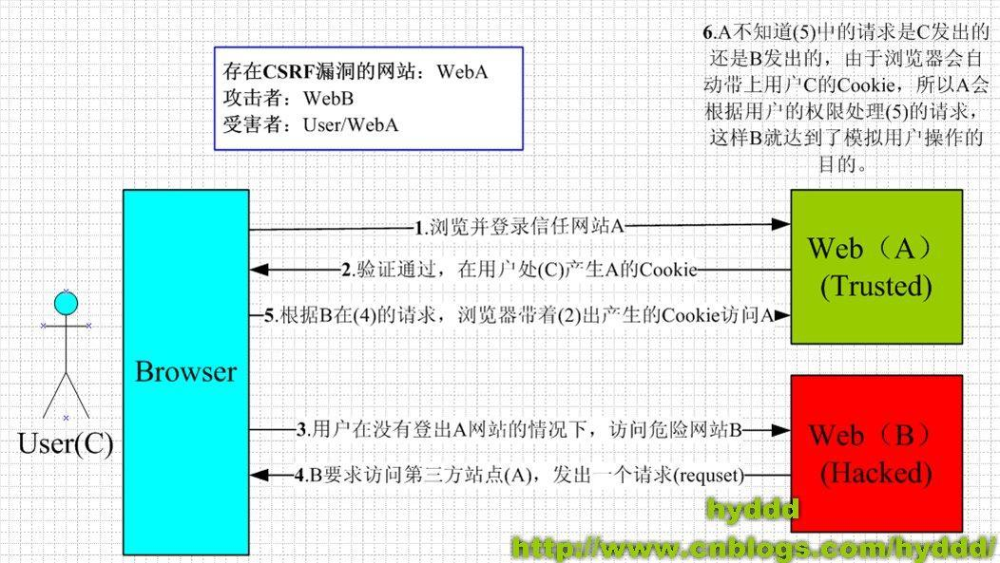

# CSRF（Cross Site Request Forgery，跨站域请求伪造）

## 原理

## 防范

* 检测 `Referrer` 是否来自当前域

    * 成本低廉，疗效显著

* get 请求参数或头信息中的 token，如 `http://a.com?token=a0b923820dcc509a`

    * 生成与验证会带来一定性能消耗，有可能加大前端和后端的工作量

    * [JWT（JSON Web Token）](http://www.jianshu.com/p/576dbf44b2ae) 是其中一种应用体现

* 验证操作

    * 输入用户信息，如用户名、密码、口令

    * 输入验证码，图像验证码、短信验证码、邮箱验证码等（后两者可能需要花些银子，且要考虑延迟接收到信息的处理情况）

* 避免访问未知或不安全的第三方链接

    * 情况一：A.com -> 点击未知链接，如友情链接等 -> B.com -> 点击有问题的 A 链接 -> A.com -> 出事了

    * 情况二：点击未知的第三方嵌入广告，进入到 B.com，其页面会自动提交表单到 A.com 中，出事了

* 用 APP 版

## 参考文章

* [浅谈CSRF](http://www.jianshu.com/p/7f33f9c7997b)

* [CSRF攻击与防御](http://blog.csdn.net/stpeace/article/details/53512283)