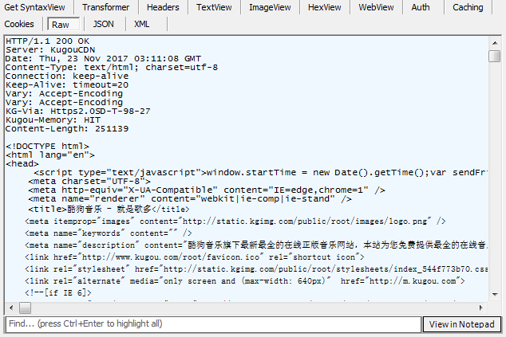

# PPT 大概思路

## 前言

在一个明朗的早上，我和我的亲愉悦地浏览我的小站，突然我的亲说：“你啥时候上广告了？”，我一脸懵 B 地拿她手机看，哎哟，还真有。。。可我手机刷了好几遍也没有出现，带着疑惑的我郁闷了一整天。。。

第二天，情况依然出现，而且这次轮到我，经过昨天基本的测试之后，推断是花生地铁 wifi 对百度统计脚本进行劫持，并慕改，导致广告插入。

So，小弟怒了，在亲的催促之下，找到了病症与良方（迷之微笑。。。）

## XSS

对！就是它——XSS，跨站脚本攻击。

作为浏览器的亲儿子，Javascript 能够在插入到页面后顺利执行（需要配合 script 等标签）。利用这一特性，可以进行多种不可描述的事情，这就是 XSS 的本质。

## 现行办法（无客户端的光环）

前端：

* `CSP`（Content Security Policy，内容安全策略）

* `SRI`（Subresource Integrity，子资源完整性）

* DIY 脚本对 DOM 进行监控与处理

后端：

* 设置头信息

    * `X-Frame-Options`（子框架展示授权）

    * `Content-Security-Policy`（内容安全策略，后端设置后，前端的 CSP 设置会无效）

    * `X-XSS-Protection`（跨脚本攻击防御，兼容低版本浏览器，现代浏览器默认都有该设置，防御效果一般，建议使用 CSP 即可）

    * `Strict-Transport-Security`（强制使用 HTTPS 协议访问资源，如果是 HTTP 访问，会被强制升级为 HTTPS 访问，可通过 `HSTS` 关键字查找相关内容）

    * `Public-Key-Pins`（证书公钥，防止中间人伪造证书，和 HTTPS 连用）

    * `Upgrade-Insecure-Requests`（使用 HTTPS 协议访问资源，一般配合 CSP 连用，对指定类型的资源使用 HTTPS 访问）

* HTTPS

**以上方法均可一起使用！**

## 我是这样解决的。。。

本次受到 XSS 主要是因为线路不安全，导致百度脚本被慕改，从而插入第三方广告，而本质上它只是顽皮而已（非破坏性）。

因此，我给页面头部加入了 CSP：

```
<meta http-equiv="Content-Security-Policy" content="default-src 'self'; img-src *; script-src 'self' 'unsafe-eval' hm.baidu.com" />
```

时至今日也一直天下太平 (*^▽^*)

那下面简单解释一下这段页面头信息的作用：

* `default-src 'self'`：给 CSP 各属性设默认值为 “仅当前域有效”

* `img-src *`：图片可以任意来源和任意类型（如 `data:` 这种）

* `script-src 'self' 'unsafe-eval' hm.baidu.com"`：js 脚本只能引用当前域和 `hm.baidu.com` 相关源的文件，当前页面允许执行 `setTimeout`、`eval` 等方法

> 更详细的使用请查看 [MDN 官网](https://developer.mozilla.org/zh-CN/docs/Web/Security/CSP/CSP_policy_directives#%E5%86%85%E5%AE%B9%E6%BA%90)

由此，可以阻断第三方非图片类型资源的加载，和阻止行内脚本、样式的执行。

再简单来说，这个第三方广告需要先插入第三方脚本，但由于 CSP 起效，第三方脚本加载失败，广告就插入不了了。

事情到这里，大概就算告一段落，但本着不折腾不死的心，让我们来了解一下 XSS 到底是什么货色？！

## XSS 族谱

这货离我们这么近，又那么远。

* 近，是因为我们每个页面都会有资源引入的行为，html、js、css、图片、flash、字体等资源一般都通过链接来引入（或 base64 等编码形式），自己的、隔壁老王的、远房亲戚的都有。这就给劫持导致的 XSS 提供了一条光明大道。

* 远，是因为发现它真心不容易。在你调试页面的时候，它一般不见踪影，但当你让页面走上“伟大航道”（感人的线上）的时候，一堆不可描述的事情接踵而来。

嗨。。。说了这么多，大概梳理一下 XSS 的种类：

* 反射型 XSS（非持久型，通过地址栏或输入框，输入问题信息，XSS 扑面而来，一般出现在搜索、即时聊天等）

* 存储型 XSS（持久型，问题数据入库，每当打开问题页面，XSS 就会伴你左右，一般出现在论坛、个人主页等）

* 文档对象模型 XSS（上面两种情况外加资源劫持引起的 DOM 被修改，一般表现为插入不知名广告，还有[让你浏览器成为挖掘机](http://pcedu.pconline.com.cn/1028/10280047.html)等）

* 通用型 XSS（浏览器缺陷或浏览器扩展漏洞导致的，危害程度较高，一般出现在插件上）

* 其他种类

    * mXSS（突变型 XSS，因二次解码导致 XSS）

    * Flash XSS（非劫持的情况下，发生在对 url 参数上的处理，与反射性 XSS 类似）

    * UTF-7 XSS（低版本 IE 专属）

    * MHTML XSS（低版本 IE 专属，mhtml 协议加载问题资源）

    * CSS XSS（低版本 IE 专属，css 中通过 `expression(...)` 调用 js）

    * VBScript XSS（低版本 IE 专属）

> 具体的解释与处理方式，请查看 [XSS.md](XSS.md)

## 还有吗？

除了 XSS 需要我们前端而外注意之外（咳咳。。。其实后端也是要注意滴），还有 CRLF 与 CSRF 也需要我们了解一下。

## CRLF



换行符（`\r\n`）注入，是根据**头信息之间用 1 个换行符相隔，头信息与正文内容用 2 个换行符相隔**的原理进行。

该注入情况一般会出现在带自定义内容的 30x 跳转。

流程大概如下：

进行 30x 跳转到 `http://127.0.0.1:8903/crlf?url=http%3A%2F%2Fbaidu.com%0d%0a%0d%0a%3Cimg%20src=0%20onerror=alert(123)%3E`，组成头部信息如下：

```
HTTP/1.1 302 Moved Temporarily 
Date: Fri, 27 Jun 2014 17:52:17 GMT 
Content-Type: text/html 
Content-Length: 154 
Connection: close 
Location: http://baidu.com


```

`%0d%0a` 在后端经过解码变成了 `\r\n`，然后就成功插入了额外的元素。

但以上只是理论性 YY，因为我的 Restify 服务器因为头信息的值中含有 `\r\n`，导致 `TypeError: The header content contains invalid characters` 错误，从而挂 B 了，所以无法复现 CRLF。

而对于 CRLF 的防范，前端可以对 `\r` 和 `\n` 进行删除，后端则要对内容进行空字符过滤。详情可看 [CRLF.md](CRLF.md)。

## CSRF


跨站请求伪造，高权限的操作进行低权限的包容导致的。

防范上更趋于后端的处理。详情可看 [CSRF.md](CSRF.md)。

## 总结

本文只列举了部分常见的前端安全问题，还有 SQL 注入、SSRF（服务端请求伪造）等问题可自行度娘，或通过下面链接提供线索：

* [Web 安全渗透方面的学习路线?](https://www.zhihu.com/question/21914899)

* [WEB安全](http://www.freebuf.com/articles/web)

* [乌云网停摆](http://www.infzm.com/content/118576)，可惜一个好站没了。。。

* [安全客-有思想的安全新媒体](http://bobao.360.cn/index/index)，360 操办的安全资讯平台