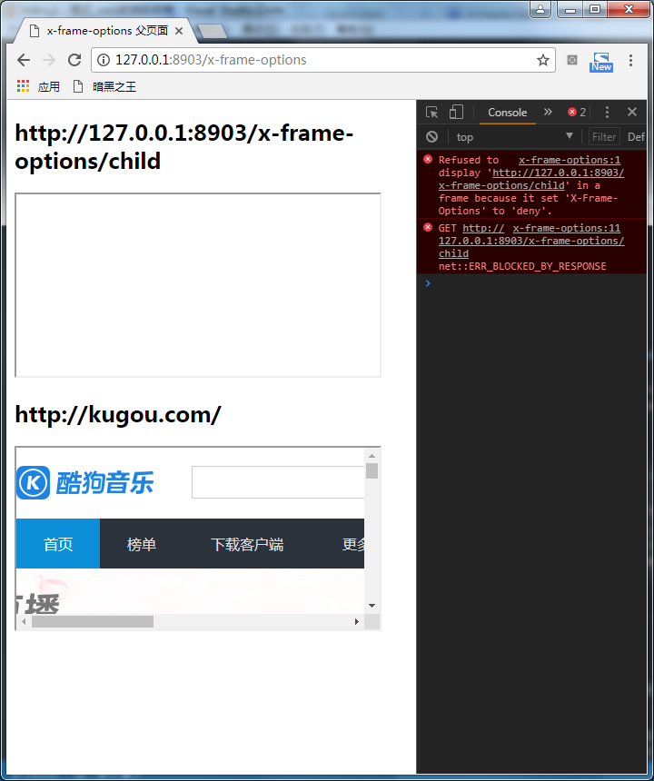
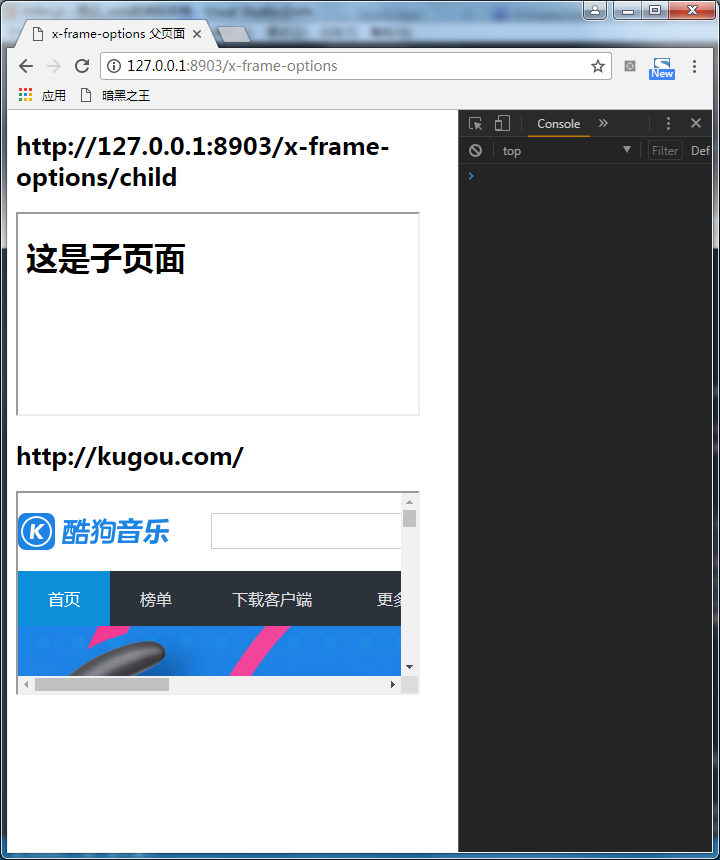
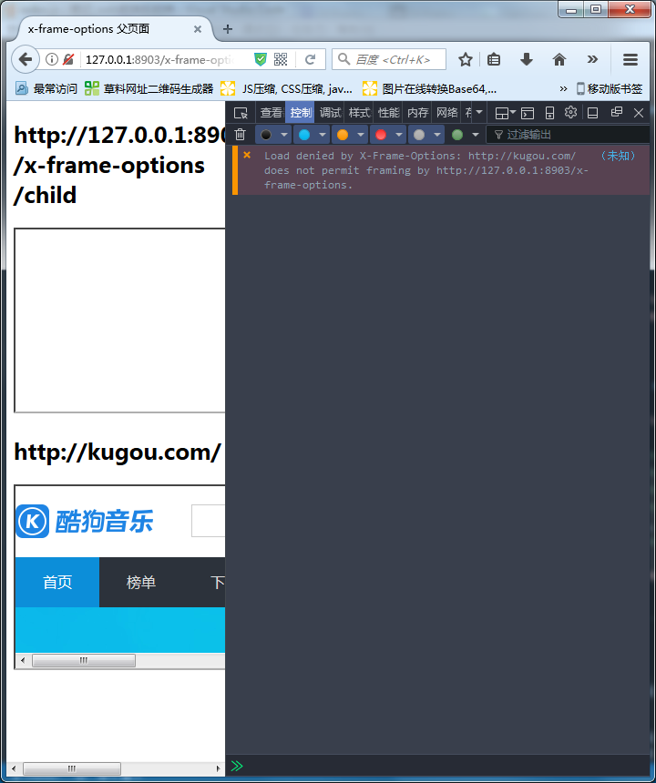
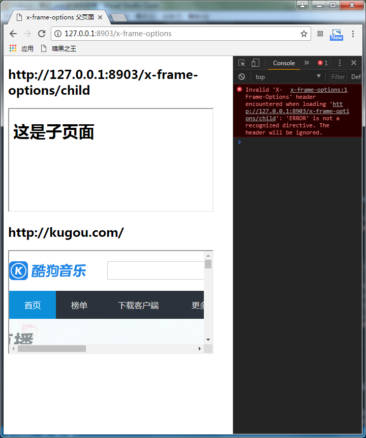

# web 前端反劫持

可通过以下方法达到一定程度上的防劫持：

* DOM 检测：对 `iframe`、`script`、`img` 等资源标签进行检测，非白名单的 url 则进行处理

* CSP：内容安全策略，给页面添加 `Content-Security-Policy` 头信息及其相应取值，让浏览器对各种加载资源进行过滤与阻塞

* SRI：子资源完整性，给 `script`、`link` 等标签添加，页面添加 `integrity`属性（非同域资源追加 `crossorigin="anonymous"`），其值为文件的 `算法-签名`（`sha256`、`sha384` 或 `sha512`）

* `X-Frame-Options`：子框架展示授权

* HTTPS：使用 `https` 协议，这是最好的解决方案
以上方法均可搭配使用。

## CSP（Content Security Policy，内容安全策略）

### 前提

* 浏览器支持版本：`IE 10+`、`Edge 12+`、`Firefox 4+`、`Chrome 14+`、`Safari 5.1+`、`IOS Safari 5.1+`、`Android Browser 4.4+`等（具体请看[该链接](http://caniuse.com/#feat=contentsecuritypolicy)）

* 页面附加 `Content-Security-Policy` 头信息（还有过渡版的 `X-Content-Security-Policy`、`X-Webkit-CSP`）
    ```
    (1) 后端添加头信息
    Content-Security-Policy: default-src 'self'; img-src 'self' img.a.com *.b.com https://*.c.com

    (2) 或者，前端添加 meta 信息
    <meta http-equiv="Content-Security-Policy" content="default-src 'self'; img-src 'self' img.a.com *.b.com https://*.c.com">

    (3) 默认加载的图片、脚本、样式等资源都要来自当前域，否则资源会被过滤掉，但图片资源可另外来自 img.a.com 的域，和 b.com 的各三级域名，和 c.com 的各三级域名的 https 协议资源
    ```

### 指令、关键字、数据

#### 指令

* `default-src`：默认有效来源，涵盖了 `child-src`、`connect-src`、`font-src`、`img-src`、`media-src`、`object-src`、`script-src`、`style-src` 指令
* `script-src`：Javascript 的有效来源
* `style-src`：CSS 的有效来源
* `img-src`：图片和图标的有效来源
* `font-src`：字体加载的有效来源
* `connect-src`：请求、XMLHttpRequest、WebSocket 和 EventSource 的连接来源
* `child-src`：web workers 以及嵌套的浏览上下文（如 `frame` 和 `iframe`）的源

#### 关键字

* `'none'`：代表空集；即不匹配任何 URL
* `'self'`：代表和文档同源，包括相同的 URL 协议和端口号
* `'unsafe-inline'`：允许使用内联资源，如内联的 `script` 元素、javascript:URL、内联的事件处理函数和内联的 `style` 元素
* `'unsafe-eval'`：允许使用 `eval` 等通过字符串创建代码的方法

```
Content-Security-Policy: default-src 'self' trustedscripts.foo.com
```

#### 数据

* `data`：允许 data:URI 作为内容来源
* `mediastream`：允许 mediastream:URI 作为内容来源
* `http`：允许 http 作为内容来源
* `https`：允许 https 作为内容来源

```
Content-Security-Policy: default-src 'self'; img-src 'self' data:; media-src mediastream:
```

* 哈希值

```
Content-Security-Policy: script-src 'sha256-2T7JHEjkVQmJ3kSbjdYofbAY6RLNkRjOG9Zze4JLeok='
```

某段内嵌的 js 脚本（即内容的算术签名为 `sha256-2T7JHEjkVQmJ3kSbjdYofbAY6RLNkRjOG9Zze4JLeok=`）会被执行

```
<script>
    alert( typeof $ );
</script>
```

### 原理

以白名单的机制对网站加载或执行的资源起作用。

### 作用

* `eval`、`new Function`、`setTimeout`、`setInterval` 等会被禁用（通过 `'unsafe-eval'` 可避免）

* 内嵌 js 代码和内嵌样式，将不会执行（通过 `'unsafe-inline'` 可避免）

* 只有通过白名单加载的资源才能执行

### 小结

通过白名单机制，进行资源过滤，浏览器支持情况还可以，既可通过后端添加头信息，也可前端使用 `meta` 进行添加，十分便利。

不过在配置时务必准确配置，以免误伤。

需要各业务层去自行配置。

## SRI（Subresource Integrity，子资源完整性）

### 前提

* 浏览器支持版本：`Chrome 45+` 或 `FireFox 43+`

* 给 `script`、`link` 等资源添加 `integrity` 属性，资源存在跨域，则需要增加 `crossorigin` 属性

    ```
    <link rel="stylesheet" href="https://maxcdn.bootstrapcdn.com/bootstrap/4.0.0-alpha.6/css/bootstrap.min.css" integrity="sha384-rwoIResjU2yc3z8GV/NPeZWAv56rSmLldC3R/AZzGRnGxQQKnKkoFVhFQhNUwEyJ" crossorigin="anonymous">
    ```

### 原理

加了 `integrity` 属性的资源标签，如果其目标资源的算法签名，与加载后资源的算法签名不一致，浏览器就不会执行该资源（但资源还是会加载的）。

### 作用

用于阻止被篡改的节点资源被执行。

### 小结

需要高版本的浏览器支持，手机浏览器比较悬，需要推行一段时间再做观察，主要阻止所加载资源被篡改的情况。

如果主程序加载不成功（因被篡改），后面的交互就有问题，这个需要考虑；这种方法防止不了页面被插入脚本或样式的情况。。。

Github 启用 SRI 是为了减少托管在 CDN 的资源被篡改而引入 XSS 的风险。

> tips：想快速在浏览器获取资源的算法，可仅设置 `integrity="sha256-x"`，然后将提示的算法值再复制到属性值中

## 子框架展示授权（X-Frame-Options）

### 前提

* 浏览器支持版本：`IE 8+`、`Edge 12+`、`Firefox 4+`、`Chrome 26+`、`Safari 5.1+`、`IOS Safari 7.1+`、`Android Browser 4+`等（具体请看[该链接](http://caniuse.com/#search=X-Frame-Options)）

* 只能后端设置头信息 `X-Frame-Options`

* CSP Level 2 规范中的 `frame-ancestors` 指令会替代这个非标准的 header，但为了兼容，还是建议加上此头信息

### 取值

* `DENY`：不允许在任何 frame 中展示

    

* `SAMEORIGIN`：允许在同域的 frame 展示【建议使用该值】

    

* `ALLOW-FROM uri`：允许指定来源的 frame 展示【此取值兼容性较差，一般不建议使用，暂时只有火狐可以支持】

    

如果取值有误，浏览器会报 `Invalid 'X-Frame-Options' header encountered` 错误，开发时请留意。



### 原理

`X-Frame-Options` HTTP 响应头是用来给浏览器指示允许一个页面可否在 `<frame>`, `<iframe>` 或者 `<object>` 中展现的标记。

### 作用

网站可以使用此功能，来确保自己网站的内容没有被嵌到别人的网站中去，也从而避免了点击劫持 (clickjacking) 的攻击。

### 小结

如果不想自己的页面被嵌入到第三方的 `frame` 中展示，请使用该头信息。

## 参考文章

* [浏览器安全策略说之内容安全策略CSP](http://sec.chinabyte.com/106/12923606_all.shtml)

* [CSP策略及绕过方法](http://www.jianshu.com/p/f1de775bc43e)

* [CSP（内容安全策略）](https://baike.baidu.com/item/CSP/13343685?fr=aladdin)

* [Web前端页面劫持和反劫持](https://mp.weixin.qq.com/s/WbrXl2PS4Kh7JtqXRCGAzQ)

* [Subresource Integrity](http://blog.csdn.net/wozaixiaoximen/article/details/56280461)

* [Subresource Integrity 介绍](https://imququ.com/post/subresource-integrity.html)

* [谨慎能捕千秋蝉（三）——界面操作劫持与HTML5安全](http://blog.csdn.net/c2iekqea/article/details/55684701)

* [X-Frame-Options 响应头](https://developer.mozilla.org/zh-CN/docs/Web/HTTP/X-Frame-Options)