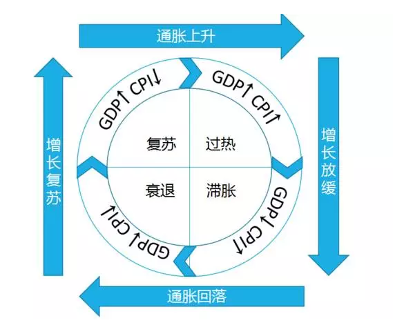
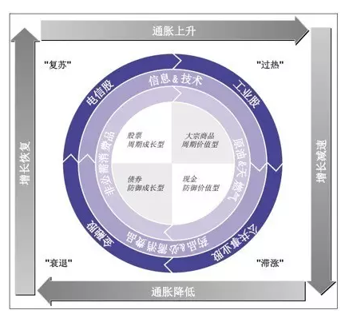
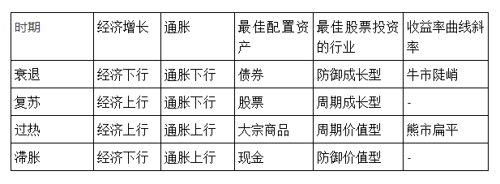

# 美林时钟

根据 `GDP` 和 `CPI` 两个维度去判断经济周期：

1. 过热（GDP ↑，CPI ↓）
1. 滞涨（GDP ↓，CPI ↑）
1. 衰退（GDB ↓，CPI ↓）
1. 复苏（GDP ↑，CPI ↓）
1. 过热...【轮回】

但如果遇到黑天鹤事件，时钟可能会跨过某些周期，直接进入另一个周期，如 2009 年中国政府拿出 4 万亿救市，使经济直接跳过衰退期。

以下为知乎徐彬的总结：

> 1. 2006 及 2007 年初的时候，GDP 高于 12%，而 CPI 只有 1% 和 2%。这是典型的高 GDP + 低 CPI，毫无疑问，这两年应该投资股票类资产
>
> 1. 2008 年 GDP 大幅减速，从年初的 14% 暴跌到 7%，而 CPI 从年初的 7% 降到 3%。因此 2008 年，经济从过热一步跨入衰退。选择债券或者货币都是有道理的
>
> 1. 2009 年初，GDP 增速已经暴跌到 7%，CPI 处于 3%，3 月份的时候，CPI 降到负数，这是典型的衰退期，按理说应该投资债券，可是政府推出了 4 万亿经济刺激政策，这种规模的刺激政策是史无前例的，一下就让经济快速从衰退期进入复苏期，因此 2009 年初应该选择债券，刺激政策出来后选择股票类资产了
>
> 1. 2010 和 2011 年是比较有难度的两年，大家需要一定的经济学知识和经验才能正确判断 4 万亿一定会带来的后遗症，这个后遗症就是滞涨，当时很多经济学家也都准确预测到了。因此这两年，应该选择货币
>
> 1. 2012 年初，GDP 进一步回落到 9%，CPI 从 7% 的高位回落到不到 5%，依然是个滞胀的组合。仅凭这两个信息继续选择货币
>
> 1. 2013 年初，GDP 进一步回落到 8%，而 CPI 回落到 2%。在新的经济常态下，这已经是一个非常健康的复苏状态了。2014 和 2015 年初的时候都是这样的状态，这样的环境是比较适合持有股票类资产的

## 参考文章

* [美林投资时钟理论](https://baike.baidu.com/item/%E7%BE%8E%E6%9E%97%E6%8A%95%E8%B5%84%E6%97%B6%E9%92%9F%E7%90%86%E8%AE%BA/3491353?fr=aladdin&fromid=18777762&fromtitle=%E7%BE%8E%E6%9E%97%E6%97%B6%E9%92%9F)

* [如何理解美林的投资时钟？](https://www.zhihu.com/question/23117153)

* [如何根据两个宏观指标10年赚17倍](http://www.360doc.com/content/16/0605/20/10170615_565324545.shtml)