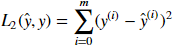

# 深度学习笔记

## 机器学习相关公式（python 环境）

以下公式，均在 python 3 运行（Anaconda 的 Notebook 运行），并使用 `numpy` 库

```
import numpy as np
```

### Sigmoid function


```
def sigmoid( x ):
    return 1 / ( 1 + np.exp( -x ) )
```

使用：

```
x = np.array( [ 1, 2, 3 ] )

print( sigmoid( x ) )
# array([ 0.73105858,  0.88079708,  0.95257413])
```

### Sigmoid gradient（Sigmoid 求导）


```
def sigmoid( x ):
    return sigmoid( x ) * ( 1 - sigmoid( x ) )
```

使用：

```
x = np.array( [ 1, 2, 3 ] )
print ( "sigmoid_derivative(x) = " + str( sigmoid_derivative( x ) ) )
# sigmoid_derivative(x) = [ 0.19661193  0.10499359  0.04517666]
```

### image2vector

三维数组变为一围数组，一般应用于图像分析

```
def image2vector( image ):
    return image.reshape( image.shape[ 0 ] * image.shape[ 1 ] * image.shape[ 2 ], 1 )
```

使用：

```
image = np.array([[[ 0.67826139,  0.29380381],
        [ 0.90714982,  0.52835647],
        [ 0.4215251 ,  0.45017551]],

       [[ 0.92814219,  0.96677647],
        [ 0.85304703,  0.52351845],
        [ 0.19981397,  0.27417313]],

       [[ 0.60659855,  0.00533165],
        [ 0.10820313,  0.49978937],
        [ 0.34144279,  0.94630077]]])

print ( "image2vector(image) = " + str( image2vector( image ) ) )
# image2vector(image) = [[ 0.67826139]
# [ 0.29380381]
# [ 0.90714982]
# [ 0.52835647]
# [ 0.4215251 ]
# [ 0.45017551]
# [ 0.92814219]
# [ 0.96677647]
# [ 0.85304703]
# [ 0.52351845]
# [ 0.19981397]
# [ 0.27417313]
# [ 0.60659855]
# [ 0.00533165]
# [ 0.10820313]
# [ 0.49978937]
# [ 0.34144279]
# [ 0.94630077]]
```

### Softmax function


```
def softmax( x ):
    x_exp = np.exp( x )
    x_sum = np.sum( x_exp, axis=1, keepdims=True )
    return x_exp / x_sum
```

### L1 loss function


```
def L1( yhat, y ):
    return np.sum( np.abs( y - yhat  ) )
```

使用：

```
yhat = np.array( [ .9, 0.2, 0.1, .4, .9 ] )
y = np.array( [ 1, 0, 0, 1, 1 ] )
print( "L1 = " + str( L1( yhat, y ) ) )
# L1 = 1.1
```

### L2 loss function



```
def L2( yhat, y ):
    return np.dot( ( y - yhat ), ( y - yhat ).T )
```

使用：

```
yhat = np.array( [ .9, 0.2, 0.1, .4, .9 ] )
y = np.array( [ 1, 0, 0, 1, 1 ] )
print( "L2 = " + str( L2( yhat, y ) ) )
# L2 = 0.43
```