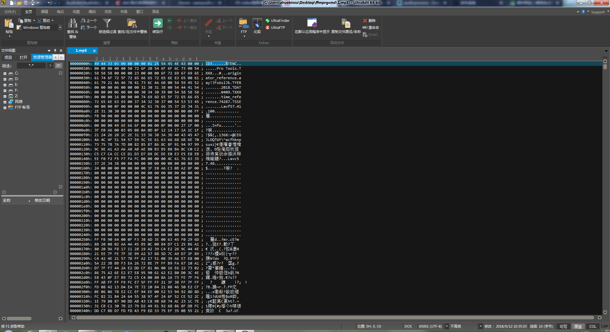
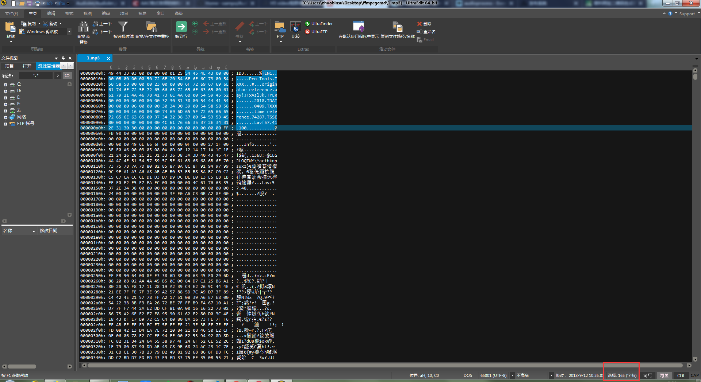
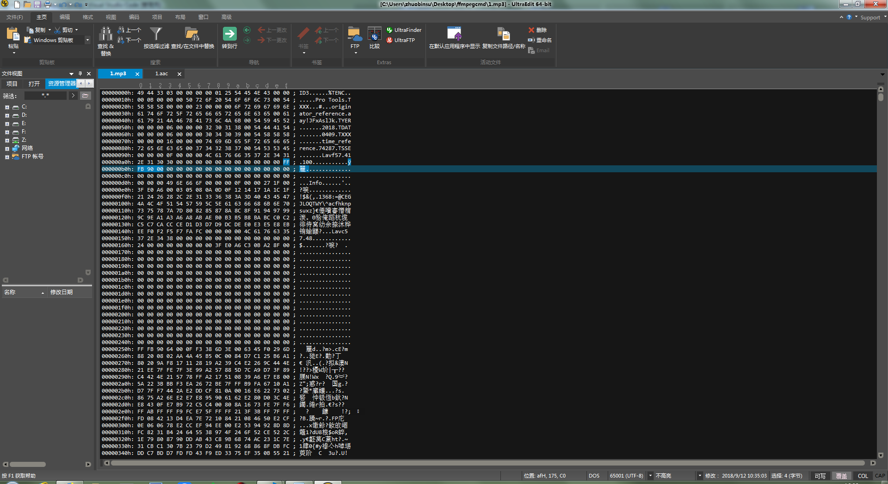
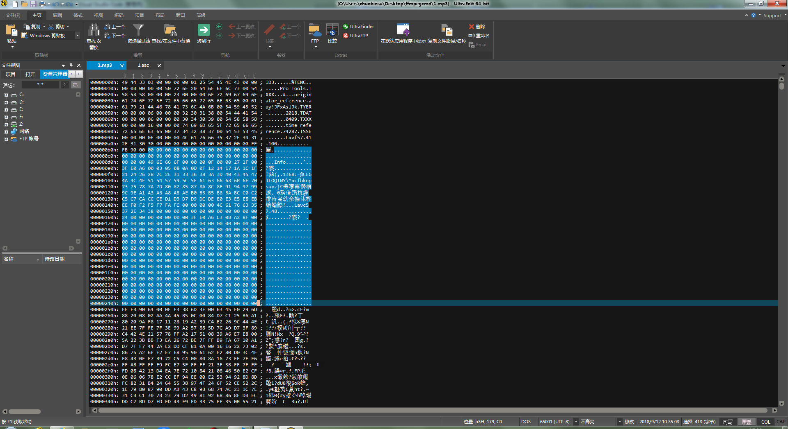
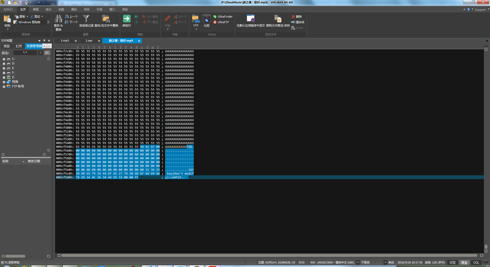

# mp3

## 数据结构

整体数据

| 名称 | 字节数 | 说明
|------|-------|-----
| ID3V2 | -     | 包含了作者，作曲，专辑等信息，长度不固定，扩展了 ID3V1 的信息量。
| Frame | -     | 一系列的帧，个数由文件大小和帧长决定
| ...   | -     | 每个 FRAME 的长度可能不固定，也可能固定，由位率 bitrate 决定
| ...   | -     | 每个 FRAME 又分为帧头和数据实体两部分
| Frame | -     | 帧头记录了 mp3 的位率，采样率，版本等信息，每个帧之间相互独立。
| ID3V1 | 128   | 包含了作者，作曲，专辑等信息，长度为 128 BYTE。


### ID3V2（头信息）



```
49 44 33 03 00 00 00 00 01 25
-------- -- -- -- -----------
|        |  |  |  | 
1        2  3  4  5
```

| 编号 | 类型与名称 | 字节数 | 说明
|------|-----------|-------|-----
| 1 | char Header   | 3 | 必须为 "ID3" 否则认为标签不存在
|   |               |   | `String.fromCharCode( 0x49 ) === 'I'`，其他位同理计算
| 2 | char Ver      | 1 | 版本号，3 表示 `ID3V2.3`
| 3 | char Revision | 1 | 副版本号，此版本记录为 0
| 4 | char Flag     | 1 | 标志，一般为 0
|   |               |   | 结构为：`abc00000`
|   |               |   | a -- 表示是否使用 Unsynchronisation (这个单词不知道是什么意思，字典里也没有找到，一般不设置) 
|   |               |   | b -- 表示是否有扩展头部，一般没有(至少 Winamp 没有记录)，所以一般也不设置
|   |               |   | c -- 表示是否为测试标签( 99.99% 的标签都不是测试用的啦，所以一般也不设置) 
| 5 | char Size     | 4 | 标签大小，包括标签头的 10 个字节和所有的标签帧的大小
|   |               |   | 结构为： `0xxxxxxx 0xxxxxxx 0xxxxxxx 0xxxxxxx`
|   |               |   | 一共 4 个字节，但每个字节只用 7 位，最高位不使用恒为 0
|   |               |   | 公式为：`total_size = ( Size[0] & 0x7F ) * 0x200000 + ( Size[1] & 0x7F ) * 0x400 + ( Size[2] & 0x7F ) * 0x80 + ( Size[3] & 0x7F )`
|   |               |   | 按示例计算为：`total_size = ( 0x0 & 0x7F ) * 0x200000 + ( 0x0 & 0x7F ) * 0x400 + ( 0x1 & 0x7F ) * 0x80 + ( 0x25 & 0x7F ) = 165`
|   |               |   | 某些数字的说明：
|   |               |   |     `0x7F` === `01111111` === `127`
|   |               |   |     `0x80` === `00000000 10000000`
|   |               |   |    `0x400` === `00000100 00000000`
|   |               |   | `0x200000` === `00100000 00000000 00000000`

### ID3V2（数据信息）



第 1 段数据（11 个字节）：

```
54 45 4E 43 00 00 00 0B 00 00 00 50 72 6F 20 54 6F 6F 6C 73 00
----------- ----------- ----- --------------------------------
|           |           |     |
1           2           3     4
```

| 编号 | 类型与名称 | 字节数 | 说明
|------|-----------|-------|-----
| 1 | char ID   | 4 | 帧标识
|   |           |   | 实例为 `TENC`，即 "Encoded by"，信息为 “用什么编码”
| 2 | char Size | 4 | 帧内容的大小，不包括帧头，不得小于1
|   |           |   | 结构为： `xxxxxxxx xxxxxxxx xxxxxxxx xxxxxxxx`
|   |           |   | 公式为：`frame_size = Size[0] * 0x100000000 + Size[1] * 0x10000 + Size[2] * 0x100 + Size[3]`
|   |           |   | 按示例计算为：`frame_size = 0 * 0x100000000 + 0 * 0x10000 + 0 * 0x100 + 0xB = 11`
|   |           |   | 某些数字的说明：
|   |           |   |       `0x100` === `00000001 00000000`
|   |           |   |     `0x10000` === `00000001 00000000 00000000`
|   |           |   | `0x100000000` === `00000001 00000000 00000000 00000000 00000000`
| 3 | char Flag | 2 | 标志，一般为 0
|   |           |   | 结构为：`abc00000 ijk00000`
|   |           |   | a -- 标签保护标志，设置时认为此帧作废
|   |           |   | b -- 文件保护标志，设置时认为此帧作废
|   |           |   | c -- 只读标志，设置时认为此帧不能修改(但我没有找到一个软件理会这个标志)
|   |           |   | i -- 压缩标志，设置时一个字节存放两个BCD 码表示数字
|   |           |   | j -- 加密标志(没有见过哪个MP3 文件的标签用了加密)
|   |           |   | k -- 组标志，设置时说明此帧和其他的某帧是一组
| 4 | char Data | - | 帧内容
|   |           |   | 这里是 11 byte 的内容 "Pro Tools"，首、末各含有一个 `\0`

第 2 段数据：

```
54 58 58 58 00 00 00 23 00 00 00 6F 72 69 67 69 6E ... 6B 00
----------- ----------- ----- ------------------------------
|           |           |     |
1           2           3     4
```

| 编号 | 类型与名称 | 字节数 | 说明
|------|-----------|-------|-----
| 1 | char ID   | 4 | 帧标识
|   |           |   | 实例为 `TXXX`，即 "Userdefined text information"，信息为 “自定义信息”
| 2 | char Size | 4 | 帧内容的大小
|   |           |   | 按示例计算为：`frame_size = 0 * 0x100000000 + 0 * 0x10000 + 0 * 0x100 + 0x23 = 35`
| 3 | char Flag | 2 | 标志
| 4 | char Data | - | 帧内容
|   |           |   | 这里是 35 byte 的内容 "originator_reference" "aay!JFxAslJk"，首、中、末各含有一个 `\0`

本例中，后面还有 4 段数据，同理这样分析，一共占 165 byte，共 6 组数据（包含 `TENC`、`TXXX`、`TXXX`、`TYER`、`TDAT`、`TXXX`）。

### Frame、音频（头信息）



```
FF FB 90 00
|
11111111 11111011 10010000 00000000
-------- -------- -------- --------
|           ||| | |   | || | | |||
1           223 4 5   6 78 9 1 111
            ab               0 123
```

| 编号 | 类型与名称 | 位数 | 说明
|------|-----------|-------|-----
| 1     | int sync              | 11    | 同步信息
| 2b    | int version           | 1     | 版本
|       |                       |       | 0：MPEG 2.0
|       |                       |       | 1：MPEG 1.0
| 2a    | int version           | 1     | 版本（当上面为 0 时才进行此处判断）
|       |                       |       | 1：MPEG 2(LSF)
|       |                       |       | 0：MPEG 2.5(LSF)
| 3     | int layer             | 2     | 层（Layer = 4 - number）
|       |                       |       | 01：Layer 3
|       |                       |       | 10：Layer 2
|       |                       |       | 11：Layer 1
| 4     | int error_protection  | 1     | CRC校验
|       |                       |       | 1：不校验
|       |                       |       | 0：校验
| 5     | int bit_rate_index    | 4     | 位率
|       |                       |       | 其值为1001，从前面可知本帧为V1，L3类型， ->128K
|       |                       |       | 【具体请看下面表格】
| 6     | int sample_rate_index | 2     | 采样率
|       |                       |       | 其值为00，从前面知本帧为 MPEG 1-> 44.1K
|       |                       |       | 【具体请看下面表格】
| 7     | int padding           | 1     | 帧长调节、补齐位
|       |                       |       | 0：无补位
|       |                       |       | 1：补 1 字节
| 8     | int extension         | 1     | 未使用
| 9     | int channel_mode      | 2     | 声道模式
|       |                       |       | 00：stereo，立体声Stereo
|       |                       |       | 01：join stereo，联合立体声
|       |                       |       | 10：dual channel，双通道
|       |                       |       | 11：single channel，单通道
| 10    | int mode_extension    | 2     | 扩展模式
|       |                       |       | 仅用于联合立体声，当声道模式为 01（联合立体声）时才使用，此处未使用
|       |                       |       | 00：MPG_MD_LR_LR
|       |                       |       | 01：MPG_MD_LR_I
|       |                       |       | 10：MPG_MD_MS_LR
|       |                       |       | 11：MPG_MD_MS_I
| 11    | int copyright         | 1     | 版权
|       |                       |       | 0：无版权
|       |                       |       | 1：有版权
| 12    | int original          | 1     | 原版标志
|       |                       |       | 0：非原版文件
|       |                       |       | 1：原版文件
| 13    | int emphasis          | 2     | 强调方式
|       |                       |       | 00：none
|       |                       |       | 01：50/15 microsecs
|       |                       |       | 10：reserved
|       |                       |       | 11：CCITT J 17

`bit_rate_index` 对应各值的表格：

| MPEG | layer | 1 (`0001`) | 2 (`0010`) | 3 (`0011`) | 4 (`0100`) | 5 (`0101`) | 6 (`0110`) | 7 (`0111`) | 8 (`1000`) | 9 (`1001`) | 10 (`1010`) | 11 (`1011`) | 12 (`1100`) | 13 (`1101`) | 14 (`1110`)
|------|-------|------------|------------|------------|------------|------------|------------|------------|------------|------------|-------------|-------------|-------------|-------------|------------
| mpeg 1.0  | 1     | 32    | 64    | 96    | 128   | 160   | 192   | 224   | 256   | 288   | 320   | 352   | 384   | 416   | 448
|           | 2     | 32    | 48    | 56    | 64    | 80    | 96    | 112   | 128   | 160   | 192   | 224   | 256   | 320   | 384
|           | 3     | 32    | 40    | 48    | 56    | 64    | 80    | 96    | 112   | 128   | 160   | 192   | 224   | 256   | 320
| mpeg 2.0  | 1     | 32    | 48    | 56    | 64    | 80    | 96    | 112   | 128   | 144   | 160   | 176   | 192   | 224   | 256
|           | 2     | 8     | 16    | 24    | 32    | 40    | 48    | 56    | 64    | 80    | 96    | 112   | 128   | 144   | 160
|           | 3     | 8     | 16    | 24    | 32    | 40    | 48    | 56    | 64    | 80    | 96    | 112   | 128   | 144   | 160

> 单位为 K，如 32 即 32000

`sample_rate_index` 对应各值的表格：

| MPEG  | 0 (`00`) | 1 (`01`) | 2 (`10`)
|-------|----------|----------|---------
| mpeg 1.0 | 44100 | 48000 | 32000
| mpeg 2.0 | 22050 | 24000 | 16000

帧大小：

|           | MPEG 1    | MPEG 2(LSF)   | MPEG 2.5(LSF)
|-----------|-----------|---------------|---------
| Layer 1   | 384       | 384           | 384
| Layer 2   | 1152      | 1152          | 1152
| Layer 3   | 1152      | 576           | 576

Layer 1 的帧长度计算公式：

`<帧长度> = ( ( <帧大小> / 8 ) * bit_rate_index / sample_rate_index ) + padding * 4`

Layer 2、3 的帧长度计算公式：

`<帧长度> = ( ( <帧大小> / 8 ) * bit_rate_index / sample_rate_index ) + padding`

按示例的计算：

1152 / 8 * 128K / 44.1K + 0 = 417

> 注意：
> * 结果直接取整
> * 单位为字节 byte
> * 417 字节，包含头信息（4 字节）与数据信息（413 字节）

### Frame、音频（数据信息）



### ID3V1



## 参考文档

* [MP3格式音频文件结构解析](https://blog.csdn.net/fulinwsuafcie/article/details/8972346)

* [mp3解码算法分析](https://wenku.baidu.com/view/fdd4282e4b73f242336c5faa.html)